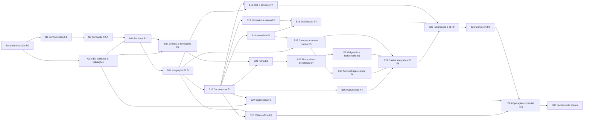

# Plano executivo de desenvolvimento BES após a candidata v1.5

Data de referência: 09/10/2026. Branch: `feature/bes-frontend`. HEAD: `d732f67d5a23248c501c99f6a58de785faa37238`.

Recomenda-se continuar o monólito modular existente em **23 blocos adicionais, propostos como B8–B30**, começando por confiabilidade e preparação para homologação. O núcleo dos sete blocos tem implementação real e uma base de testes relevante, mas não há evidência suficiente para declarar produto homologado, SaaS, folha, tesouraria ou visão integral concluídos. A primeira expansão empresarial deve seguir **B9/F2-A → B10/E1 → B11/F2-B**.

Este documento organiza a conclusão do escopo, sem autorizar sua execução. A v1.4 continua mestre oficial. A v1.5 foi registrada como candidata auditada e aprovada para commit documental; não foi promovida automaticamente. Números B8–B30 são uma proposta de organização, não blocos iniciados, novos RFs ou alteração do roadmap oficial. O proprietário deve autorizar cada recorte antes da implementação. Propostas PR e assuntos sem definição continuam sujeitos a decisão específica.

## 1. Checkpoint, fontes e limites do diagnóstico

Executados `git branch --show-current`, `git rev-parse HEAD`, `git status --short` e `git log -5 --oneline`. Branch/HEAD corresponderam ao pedido; working tree e staging estavam limpos. Histórico observado: commit documental v1.5; estabilização/premium; EPI; ativos; Obras/OS/CC. Não houve reset, descarte, troca de branch ou reinício de projeto.

Fontes: [AGENTS](../AGENTS.md), [índice](README.md), DOCX [v1.4 oficial](Documentacao_Mestre_Plataforma_BES_v1_4.docx) e [v1.5 candidata](Documentacao_Mestre_Plataforma_BES_v1_5_Candidata.docx), [matriz](matriz-rastreabilidade-bes-v1_5.md), [inventário JSON](inventario-tecnico-bes-v1_5.json), [roadmap](roadmap-integral-bes-v1_5.md), todos os relatórios v1.5 de consolidação/auditoria/correções/verificação, [eixo RH/DP](bes-eixo-rh-dp-folha-beneficios-financeiro-v1_5.md) e fontes duráveis. Documentos técnicos: catálogo, estoque, atendimento, compras, contexto, ativos, EPI, autenticação, segurança, API, relatórios dos blocos e retomada premium.

Os dois DOCX foram extraídos diretamente em somente leitura: 511 parágrafos na v1.4 e 2.845 na candidata. Os textos documentais foram carregados integralmente; a conferência estruturada percorreu os 218 RFs, 12 RNFs, 56 capacidades, decisões e propostas. A análise semântica concentrou-se nas regras, limites e dependências pertinentes ao planejamento. Leitura computacional integral e verificação de referências não equivalem a homologação frase por frase de cada comportamento.

A inspeção direta incluiu pacotes Java/modelos/controllers/services/repositories, configuração de sessão/CSRF/authorities e auditoria, `pom.xml`, propriedades de aplicação/teste, páginas e cliente React, rotas, componentes, testes associados, configuração Playwright, scripts H2 e SQLs manuais. Todos os caminhos de implementação/testes referenciados nos registros RF/RNF existem. Isso comprova presença, não cobertura funcional integral. A leitura aprofundada de fluxos representativos verificou transferência quantitativa, atendimento, recebimento, contexto, custódia e entrega/fechamento EPI.

Não foram executadas suítes, build, servidor, banco externo, deploy, migração, commit ou push nesta rodada. Não houve nova inspeção visual de telas/dispositivos. Evidências históricas são explicitamente históricas. Manifest de hashes, extrações e verificações auxiliares ficaram em TEMP, fora do repositório. Apenas este plano foi criado.

## 2. Diagnóstico técnico do software existente

### 2.1 Arquitetura e reutilização

Backend Spring Boot/JPA em Java 17, com pacotes de domínio `compras`, `obras`, `ativos`, `epi`, serviços operacionais e segurança compartilhada. `pom.xml` observado declara Spring Boot 4.1.1, MySQL runtime e H2 2.5.250 somente test scope. Frontend React/Vite/Tailwind com React Router, Lucide, componentes comuns e cliente de sessão/CSRF. As versões são as declaradas no repositório, sem parecer de atualização ou segurança de dependências nesta rodada.

Preservar Produto, Estoque, NecessidadeCompra, PedidoCompra, contextos e eventos existentes. Não criar segundo catálogo, segundo saldo EPI ou agregado concorrente de compra. Manter a SPA e o padrão premium; expandir fronteiras internas e contratos antes de considerar serviços independentes. Extração para microsserviços dependeria de medição e justificativa futura, não é pré-requisito.

### 2.2 Sete blocos operacionais e situação observada

| Bloco/domínio | Implementação comprovada por leitura | Lacuna material e evidência direta |
|---|---|---|
| B1 catálogo/cadastros | Produto/categoria/unidade, busca/equivalentes, seletor e telas; `ProdutoService`, `ProductPicker`, `Products` | Atributos por categoria, produto provisório, aprovação e conversões completos ausentes; Funcionário tem somente id/nome/matrícula/função |
| B2 estoque/transferências | Saldo por Produto/local, limites, alertas/reposição e transferência transacional; `EstoqueService`, `TransferenciaEstoqueService`, `Transfers` | Estoque usa `double`; transferência não recebe chave persistida; execução imediata não é logística em trânsito; inventário físico/estorno formal ausentes |
| B3 solicitações/atendimento | Aprovação separada da SAÍDA, separação, parcial, falta/necessidade e lista imprimível; `AtendimentoSolicitacaoService`, `RequestDetails`, `SeparationList` | Hierarquia/alçadas configuráveis, retirante terceiro e notificações ausentes; legado ambíguo exige reconciliação; comando incerto não sobrevive à recarga da tela |
| B4 compras/recebimento | Pedido único, fornecedor, alocações, preços decimais, aprovação, recebimento parcial com chave, ENTRADA e snapshots; `PedidoCompraService`, `PurchaseOrders` | RF035 parcial: COMPRADO/aceite externo não separado; NF/XML/cotações e reversões completas ausentes; quantidades continuam legadas |
| B5 Obras/OS/CC | Estrutura, transições, contexto congelado e resumos quantitativos; `EstruturaService`, `ContextoService`, `Structure` | Orçamento/valorização, equipes e painel financeiro ausentes; cliente textual em Obra não é empresa; HTTP 500 histórico não tem causa comprovada |
| B6 ativos/custódia | Empréstimo/devolução, transferência/chegada, inspeção simples, condição/baixa e eventos idempotentes; `AtivosService`, `Assets`, `AssetDocument` | Reservas, manutenção/calibração, agenda/checklists versionados e evidências anexas ausentes; não confundir INDISPONIVEL com ordem de manutenção |
| B7 EPI operacional | Configuração 1:1 Produto, entrega/substituição/devolução/descarte, snapshots/eventos, saldo único e documento; `EpiService`, `ItemEpi`, `EpiDeliveryForm` | Eventos DECIMAL(19,6) coexistem com saldo `double`; lote informado na entrega não é saldo por lote; ficha atual não conclui prontuário legal, matriz, aceite do trabalhador ou SST |

### 2.3 Segurança, dados e operação

`SegurancaConfig` usa sessão, CSRF, BCrypt, cookie HttpOnly/Secure e CORS explícito; `RotasPermissao` e services aplicam authorities. Perfis existentes: ADMIN, GESTOR, ALMOXARIFE, CONSULTA. `Autorizacao` verifica atividade/versão de autenticação; isso não cria escopo empresarial ou individual. Leitores autorizados acessam o domínio conforme a política global atual. Não existe perfil funcionário com portal privado entregue.

`AuditoriaService.registrar` exige transação MANDATORY; eventos críticos dos novos domínios preservam ator autenticado e responsável operacional. Esse mecanismo deve ser reaproveitado, sem alegar cobertura universal por sua mera existência. Publicações, integrações e processamentos futuros precisam de auditoria/idempotência próprias.

Configuração externa de banco é obrigatória fora de test, validada antes do datasource. `ddl-auto=none` no ambiente comum e `create-drop` exclusivamente no teste. Scripts SQL manuais existem; não foi encontrado mecanismo Flyway/Liquibase configurado no POM. PostgreSQL é alvo documental, enquanto a dependência runtime atual é MySQL: escolher e homologar o alvo antes de preparar rollout. Não inferir compatibilidade real a partir do modo MySQL do H2.

Não foram localizados workflows `.github`, Docker/compose ou dependências Actuator/Micrometer na configuração examinada. Não há evidência de pipeline, backup/restore, SCA backend ou observabilidade produtivos homologados. A ausência localizada não exclui infraestrutura externa não fornecida: registrar como decisão/evidência pendente.

### 2.4 Separação entre tela, backend, integração e entrega

| Categoria | Situação identificada |
|---|---|
| Fluxos com backend e tela | Catálogo, estoque, atendimento, compra/recebimento, estrutura, custódia e EPI têm rotas e services reais; o recorte entregue deve ser preservado |
| Somente preparação visual | Inventário aparece como futuro em `AppShell`; não possui módulo funcional entregue. Link/deep link não comprova QR, PWA, download ou integração |
| Recursos de UI sobre dados existentes | `OperationalDocument` renderiza/ imprime no navegador; não há motor PDF backend ou repositório/versionamento documental completo. Dashboard é composição de consultas, não BI financeiro |
| Capacidade existente na API sem superfície completa | Consulta paginada de auditoria existe no backend; não foi localizada página central de auditoria entre as rotas React. Inventariar também os filtros expostos na API que não têm controles de tela completos ao fechar cada bloco |
| Documentado e não desenvolvido | Empresas/isolamento, RH amplo, folha, benefícios, tesouraria, manutenção completa, inventário, offline, licenciamento e módulos históricos de campo/engenharia |
| Precisa de integração | Função/vínculo com consumidores; EPI com prontuário/matriz; documentos com storage/acesso; custos com valorização e fontes; financeiro com fornecedores/bancos homologados |
| Precisa de correção/evolução | Precisão coordenada, idempotência quantitativa, investigação B5, foco resize residual, recuperação de senha, legados e protocolos de migração |

### 2.5 Os totais não significam prontidão global

Inventário documental confirmado: **37 implementados e validados, 74 parciais, 103 planejados e 4 dependentes de validação**, total 218. RNFs: oito parciais e quatro planejados. Capacidades futuras: 16 RH, 11 FOL, 14 BEN e 15 FIN, total 56; 20 planejadas e 36 dependentes de validação. Dez DP e 21 PR permanecem séries separadas.

Para os 37, a inspeção encontrou código/telas/testes associados nos domínios correspondentes; não houve demonstração nova de funcionamento. A etiqueta deve continuar qualificada como validação anterior do núcleo. Para os 74, os limites declarados têm correspondência nos exemplos estruturais acima. Para os 103/4 e capacidades futuras, não foram localizados agregados/motores que sustentem promoção de estado. **Não se reclassifica a matriz nesta rodada.** Qualquer discrepância fina deverá virar evidência por cenário no B8 ou no bloco responsável, sem inventar novos totais.

Exemplos que impedem conclusão indevida: RF035 não contém COMPRADO; RF061 cobre cadastro operacional e não orçamento; RF099/101 não concluem SST; RF057 não certifica isolamento empresarial; RF216 é componente reutilizável, não serviço de documentos universais. RF205–218 devem ser reavaliados em todos os incrementos.

Resultados 568 backend, 125 Node, 109 Playwright, 14 premium, build e npm audit registrados em [retomada](bes-retomada-controlada-20261009.md) pertencem à execução anterior. Playwright configurado usa Chromium, um worker e zero retries; não demonstra Android/iPhone ou leitor de tela. `target` pode conter regressão vermelha intencional do H2 antigo, conforme relatório; não interpretar o último artefato isolado como reprovação da suíte verde arquivada.

## 3. Escopo integral e responsáveis por fechamento

O anexo A preserva individualmente os 218 RFs com redação, estado documental e blocos de acompanhamento. Anexo B mantém 12 RNFs; anexo C mantém as 56 capacidades; anexo D mantém DP/PR. Esses anexos complementam a matriz canônica, sem substituí-la. Um bloco relacionado não recebe automaticamente todo o RF como concluído: aceites remanescentes e cobertura transversal passam ao B30.

| Família integral | Entregue e lacunas | Responsáveis propostos |
|---|---|---|
| Administração, empresas, acesso e privacidade | Baseline de sessão/authority; empresa, setor, escopo, perfil individual, recuperação e configuração ainda precisam evoluir | B8–B11, B29, B30 |
| Catálogo, materiais, unidades e fornecedores | Núcleo compartilhado; atributos, provisórios, serviços e conversões pendentes | B8, B14, B16, B17 |
| Estoque, inventário, lotes, série, bobinas e sobras | Saldo/local; granularidade física, inventário inicial/cíclico, ajustes e reconciliação faltam | B8, B14 |
| Solicitações, aprovação, atendimento, retirada e transferência | Fluxo existente; hierarquia, terceiro, notificações, devolução e demandas de ativos/EPI incompletos | B8, B12, B16, B18 |
| Compra, cotação, emissão externa, NF/XML e recebimento | Pedido/recebimento existentes; fiscal, divergências/reversões e custos completos faltam | B17, B22, B24 |
| Obras, OS, CC, equipes, consumo e orçamento | Cadastro/snapshot quantitativo; orçamento, indicadores e despesa valorizada faltam | B10–B11, B17–B19, B24–B25 |
| Ativos, patrimônio, reservas, custódia e perda | Operação individual; reserva, custo, evidência, manutenção e calibração faltam | B12, B15–B17, B24 |
| EPI, SST, prontuário, matriz, caixas, checklists e aceites | Eventos operacionais; vigências, matriz, aceites, anexos, cadeia física, SST e caixas faltam | B10–B13, B14–B16, B19 |
| RH/DP, vínculos, jornada, ponto, afastamentos, férias, 13º e portal | Cadastro simples; todas as capacidades ampliadas são futuras | B10–B11, B20–B23 |
| Folha A/B, oficialização, regras e retificação | Sem motor; fonte oficial única por empresa/competência é regra documental obrigatória | E0, B20–B23 |
| Benefícios, elegibilidade, tarifas, recargas e conciliação | Sem módulos; contratos e regras dependem de validação | B20–B23 |
| Financeiro, pagar/receber, caixa, provisões, custos e bancos | Preço de compra não é tesouraria; sem financeiro entregue | B20, B22–B24 |
| Frota, entregas/coletas, locações, alojamentos, refeições e viagens/folgas | Escopo histórico preservado, sem desenvolvimento localizado | B18, B20, B24 |
| Alocação, atividade, feedback, PDI, carreira e melhoria | Sem implementação; sem punição/ranking automático | B19, B25–B26 |
| Documentos, fotos, central, versões, QR, PDF e impressão | Template/print atuais; infraestrutura documental e acesso completo faltam | B12, todos os domínios, B30 |
| Alertas, notificações, pesquisa, relatórios, importação, API e BI | Alertas em tela/resumos; central, delivery, métricas e exportações completos faltam | B12, B25 |
| Diário de obra e IA | Sem produção automática; rascunhos/extratos candidatos sob decisão humana | B25–B26 |
| Engenharia, biblioteca, calculadoras, isométrico e fabricação | Escopo histórico preservado; parâmetros/casos precisam de responsável técnico | B27 |
| Mobile, acessibilidade, PWA e offline | SPA responsiva não é PWA/offline; dispositivos/contingência precisam de validação | B8, todos os blocos, B28–B30 |
| Operação, backups, monitoramento, licenças, demo, vendas e suporte | Documentados; sem homologação produtiva/comercial comprovada | B8–B9, B29–B30 |

DDS, formas específicas de assinatura, políticas de carreira, anonimato e requisitos de clientes devem ser definidos pelos responsáveis antes do recorte. A lista orientativa do pedido não cria silenciosamente um novo RF. PGR/PCMSO/eSocial completos não são inferidos do EPI nem acrescentados como entregas já aprovadas; sua abrangência exige decisão rastreada no E0/B19.

## 4. Dependências e ordem recomendada

### 4.1 Gates prévios e mapa sem ciclos

F0 tem auditoria documental concluída para commit, mas decisões de implantação, dados, piloto e métodos ainda não encerradas. **E0 é um gate de decisões/contratos**, iniciado em paralelo ao desenho B8/B9 e obrigatório para B10 e para regras de B20–B23. Não exige folha, BI ou tesouraria implementados. Os desenhos FOL06/FIN01/FIN11/BEN06 podem ser especificados cedo; suas entregas executáveis seguem pré-requisitos, não a ordem numérica de IDs.

O grafo representa a edição integral e pré-requisitos fortes/contratos aprovados, sem prazos. B25 integral exige produtores da edição; adaptadores podem ser desenhados antes. B27 usa validação técnica própria; a ligação E0 indica responsáveis/contratos, não dependência de cálculo trabalhista. B28 deve testar cada domínio elegível depois de seu produtor estar pronto; a ligação B11/B12 é somente a fundação. Não liberar offline de módulo futuro por antecipação.

Uma ordenação de referência é B8 → B9 → B10 → B11 → B12 → B13 → B14 → B15 → B16 → B17 → B18 → B19 → B20 → B21 → B22 → B23 → B24 → B25 → B26 → B27 → B28 → B29 → B30. E0 acompanha os primeiros gates. B20 pode avançar após B10/E0 sem aguardar B18/B19; B14/B15 e B27 têm ramos independentes. Essa paralelização reduz espera sem reintroduzir F2 ↔ E1.

O grafo usa dependências do fechamento integral dos blocos. Subincrementos de compra/cotação/NF em B17 podem avançar sobre o núcleo atual depois de B11/B12 sem aguardar toda a granularidade B14; valorização por lote exige a granularidade aplicável. O método de custo aprovado determina esse recorte. Da mesma forma, relatórios e adaptadores de B25 podem fechar uma fonte homologada antes de todos os produtores, sem alegar F8 integral concluído. Desenho E0 não exige FOL03/FOL06/FIN01 executáveis antes de seus próprios pré-requisitos; distingue aprovação de contratos da execução de capacidades.

### 4.2 Prioridade e esforço relativo

P0 = integridade/fundação; P1 = desbloqueio/valor operacional; P2 = expansão dependente. Esforço é comparativo, não prazo: M = uma jornada com contratos existentes; G = várias jornadas/migração ou integração; GG = múltiplos domínios, alto risco/validação. Nenhuma estimativa incorpora equipe ou disponibilidade externa não informadas. Reestimar após desenho e casos de referência; não somar tamanhos como datas.

| Bloco proposto | Fase | Prioridade | Dependências principais | Esforço | Valor principal |
|---|---|---|---|---|---|
| B8 Confiabilidade e homologação do núcleo | F1 | P0 | F0, banco/precisão/escopo aprovados | GG | Base segura, menos retrabalho |
| B9 Fundação empresarial | F2-A | P0 | B8, implantação/dados | GG | Isolamento e produto por cliente |
| B10 Identidade e histórico funcional | E1 | P1 | B9, E0 | G | Pessoas/vigências reutilizáveis |
| B11 Vínculos integrados ao núcleo | F2-B | P0 | B9/B10 | G | Controle de acesso e histórico consistentes |
| B12 Documentos, QR, evidências e notificações base | F3 | P1 | B8/B11, storage/políticas | G | Operação digital e rastreabilidade |
| B13 Prontuário, matriz EPI e caixas | F3 | P1 | B10–B12, SST/jurídico | G | Diferencial operacional EPI/custódia |
| B14 Inventário e rastreabilidade física | F4 | P1 | B8/B11/B12 | GG | Saldos confiáveis e abertura física |
| B15 Manutenção, inspeções e calibração | F4 | P1 | B11/B12, regras técnicas | G | Disponibilidade dos ativos |
| B16 Mobilização, reservas e demanda ampliada | F4 | P1 | B13/B14, checklists/contratos B12 | G | Preparação de obra e redução de faltas |
| B17 Compras completas, orçamento e custos básicos | F5 núcleo | P1 | B11/B12/B14, valorização | GG | Compra/custo conferível sem folha |
| B18 Logística e administração de campo | F6 | P1 | B11/B12/B17 | GG | Permanência/transporte rastreáveis |
| B19 SST, alocação e desenvolvimento de pessoas | F7 | P1 | B11/B12, validação SST/RH | GG | Segurança e gestão humana |
| B20 Jornada, benefícios e financeiro base | E2 | P1 | B10/E0, FOL06 desenhado/validado | GG | Eventos e contratos de cálculo |
| B21 Folha A/B e documentos individuais | E3 | P1 | B20/B12, referências legais/provedores | GG | Folha conferível, fonte oficial única |
| B22 Benefícios, tesouraria e canais externos | E4 | P1 | B21, contratos técnicos | GG | Integração e conciliação sem duplicidade |
| B23 Migração A/B e fechamento gerencial | E5 | P1 | B22, saldos/restore | G | Corte controlado e continuidade |
| B24 Custos integrados por pessoa/Obra/OS/CC | F5/E5 | P1 | B17/B18/B15/B23 | G | Previsto/realizado sem dupla contagem |
| B25 Integrações, relatórios, BI e alertas completos | F8 | P2 | Produtores prometidos F1–F7/E5 | GG | Informação autorizada e interoperabilidade |
| B26 Diário, documentos e consultas assistidas | F8 | P2 | B12/B25 e fontes homologadas | G | Apoio humano com fonte verificável |
| B27 Engenharia e fabricação | F9 | P2 | Validação técnica, B12 para documentos | GG | Memória de cálculo e trabalho de campo |
| B28 PWA, acessibilidade e offline elegível | F9 | P1 de qualidade/P2 expansão | B11/B12 e cada produtor elegível | GG | Campo/contingência sem conflitos ocultos |
| B29 Operação comercial e lançamento por edição | F10 | P0 de lançamento | Gates da edição, segurança/infra | GG | Produto vendável e suportável |
| B30 Fechamento integral e auditoria de cobertura | Todas | P0 de conclusão | Todos os blocos/aceites aplicáveis | G | Evidência integral RF/RNF/capacidades |

## 5. Próximos três blocos detalhados

### B8 Confiabilidade e homologação do núcleo

1. **Objetivo:** tornar reproduzível e verificável a base existente antes de ampliar pessoas/empresa; investigar erros e fechar integridade prioritária. É a primeira implementação recomendada, sujeita a aprovação.
2. **Incluído:** diagnóstico B5 com correlação segura; regressões de renovação de conexão e proxies; política de precisão e migração coordenada do fluxo quantitativo; idempotência para transferência e entrada/saída manual conforme inventário aprovado; reconciliação de legados sem contexto/contador fictício; baseline versionado de schema; auditoria/observabilidade mínima e fechamento do foco resize residual quando reproduzido. Dividir B8 em B8-A evidência/contratos, B8-B implementação vertical e B8-C homologação autorizada; não exigir resolver todos os estornos futuros aqui.
3. **RFs/capacidades:** RF009–013/031–033/053–057/148–155/199/204/213–214; RNF001–010. Preservar RF014–018/034–037/061/078–079/099–101/202–218. DP09 participa da decisão de infraestrutura; nenhuma capacidade de folha é entregue.
4. **Dependências:** escopo, banco alvo, escala por unidade, arredondamento e política de legado aprovados; ambiente e acesso de homologação autorizados separadamente. Se banco não for decidido, desenho e H2 avançam, mas B8-C não é dado como aprovado.
5. **Backend:** conservar protocolos e constraints; evoluir quantitativos de Estoque/movimentos/itens/demanda/compra/transferência e ponte EPI conjuntamente, evitando API decimal de fachada sobre saldo binário. Definir versão compatível dos DTOs e resposta consultável do comando; adaptar leitores antigos de modo explícito. Correlacionar falhas sem expor mensagens/payloads/secrets. Nenhuma alteração de H2 runtime: permanece test scope.
6. **Frontend:** reutilizar `client`, utils e componentes; receber/enviar decimais conforme contrato aprovado; manter chave e payload da tentativa, consulta de resultado e bloqueio de duplicação. Só persistir informação local autorizada e minimizada; não gravar sessão, secrets ou conteúdo sensível por conveniência. Migrar todas as telas quantitativas no recorte e corrigir foco sem regressão de busy/modal/drawer.
7. **Banco/migrations:** escolher ferramenta e estratégia, inventariar scripts manuais, baselinar schema existente com checksum e precondições; ensaiar expansão/migração/validação/contração e compatibilidade do binário anterior. Relatório de valores inválidos/precisão, totais e relações; sem backfill fictício. Backup/restore é condição para aplicar em ambiente autorizado. Rollback de dados pode exigir restauração ou correção progressiva; DDL reverso não é garantia.
8. **Integrações:** exclusivamente núcleo existente e ambiente de homologação autorizado; sem conector financeiro, dinheiro ou acesso real nesta rodada de planejamento. Produzir comandos documentados de reprodução segura.
9. **Segurança:** conservar HTTP/service/CSRF, ator separado, auditoria atômica; revisão de configuração externa/staging e scanner de segredos; rotação histórica pelo responsável em autorização separada; nenhum endpoint operacional público para diagnóstico.
10. **Testes:** reexecutar suites isoladas pertinentes, identificar resultados verdes/vermelhos; concorrência entre transferência/atendimento/recebimento/manual/EPI; replay/corpo alterado; rollback da auditoria; conversões extremas e fracionamento; schema e locks no banco escolhido quando autorizado; contrato do frontend e E2E inteiro após alterações transversais.
11. **Aceite:** a) duas tentativas simultâneas com mesma chave/corpo deixam um comando/evento e saldo correto; chave/payload diferente conflita; b) falha após primeira mutação reverte saldo, itens, chave e auditoria; c) 0,1/0,2 e valores-limite produzem resultados decimais definidos, sem epsilon autorizando excesso; d) migração preserva referências e reconcilia totais segundo regra aprovada; e) homologação registra dialect/isolamento, locks e restore; f) regressões de permissão/sessão/CSRF e jornadas premium passam; g) B5 tem causa demonstrada ou investigação delimitada com risco formalmente aceito, sem afirmar resolução universal. Risco aberto impeditivo de integridade bloqueia o gate, mesmo com suíte verde.
12. **Riscos:** migração quantitativa transversal, legados ambíguos, ambiente não disponível, incidentes sem evidência, incompatibilidade DTO, regressão de locks. Reduzir por subincrementos, fixtures congeladas e comparação de saldos, não por relaxar constraints.
13. **Esforço/valor:** GG; alto valor por evitar refazer todos os novos domínios em base numérica ou operacional instável.
14. **Condição para B9:** contratos e schema/precisão estabilizados, casos críticos/auditoria aprovados, plano do banco e isolamento decidido. Protótipos de contrato B9 podem ocorrer antes; concluir B9/F2-A exige gate F1 aplicável.

Os itens anteriores cobrem objetivo, funcionalidades, referências, dependências, backend, frontend, banco, integrações, segurança, testes, aceite, riscos, esforço, valor e próximo gate. Identificação B8 constitui o número/nome do recorte.

### B9 Fundação empresarial e configuração por cliente F2-A

1. **Objetivo:** estabelecer empresa, unidade, departamento e isolamento sem exigir histórico RH pronto. Tornar a BES independente da identidade de um potencial cliente.
2. **Incluído:** identidade empresarial, configuração/branding, vínculo de usuários ao escopo, autoridades, contrato de pessoa/vínculo, políticas de leitura/escrita, administração e recuperação segura de senha. Organização e ambiente por cliente não dependem de folhas ou vínculos de E1 implementados.
3. **RFs/capacidades:** RF003/004/053–058/107/148/154–156/168/206; RNF001/003/006/008/010; DP01/09 e fundação para todas as RH/FOL/BEN/FIN. Não declarar DP10 licenciamento concluído.
4. **Dependências:** B8 e decisão do proprietário entre implantação isolada e compartilhada; titularidade, administradores, identidade empresarial, propriedade de catálogos e dados pessoais/operacionais. E0 define responsáveis e contratos em paralelo.
5. **Backend:** módulo empresa/unidade/departamento e associação de acesso; resolver escopo no servidor, nunca aceitar `empresaId` como autoridade. Se compartilhado for aprovado, filtrar listagens/detalhes/mutações e validar FKs/uniques por escopo em todos os módulos ativos. Se isolado for aprovado, comprovar separação de instâncias/banco/segredos/storage e desenhar a evolução sem alegar tenant lógico entregue. Contrato de identidade com IDs estáveis, vigências e snapshots; não criar histórico funcional fictício.
6. **Frontend:** configuração por empresa, administração/escopo permitido, departamentos e identidade textual/autorizada; navegação por permissões. Troca de escopo invalida dados/cache e comandos ainda não enviados; comando já confirmado mantém origem auditável. Recuperação de senha não revela existência de conta. Reutilizar Brand e shell, sem inventar logo.
7. **Banco/migrations:** empresa/unidade/departamento, associação de usuário, escopo e constraints conforme arquitetura escolhida; levantar origem dos dados antigos com responsável antes de atribuir empresa. Não associar legado à B&S por inferência. Se bases separadas, provisionamento/schema versionado e restauração por cliente; se compartilhada, índices/uniques/FKs e controle de escopo ensaiados.
8. **Integrações:** nenhum RH/folha exigido; configuração de entrega de recuperação somente com provedor autorizado e mocks antes de homologação. Portas para storage/exportação e futuras integrações com empresa sempre explícita.
9. **Segurança:** sessão e authVersion, menor privilégio, anti-enumeração/expiração/uso único no reset, escopo em HTTP/service/query/download/auditoria; sem autoatribuição de empresa/perfil. Segredos de cada cliente externos.
10. **Testes:** empresa A/B, troca de IDs/filtros e FKs, sessões/revogação e usuário sem empresa; isolamento de listagens, lookup de documento, exportação e job; reset/replay/CSRF; compatibilidade do núcleo. Instâncias separadas exigem também testes de segregação de ambiente/backup, não somente query.
11. **Aceite:** acesso de A ao registro/documento de B é negado sem vazamento; combinação A/B na mesma escrita não persiste; código repetido só conforme política empresarial; alteração de configuração não reescreve eventos; usuários sem escopo falham de modo seguro; recuperação não expõe conta/token e token consumido não repete. Evidência de isolamento cobre a arquitetura escolhida e explicita o que ainda não suporta.
12. **Riscos:** cobertura incompleta de consultas/exportações, permissões administrativas amplas, legado sem titular definido, catálogo compartilhado indevido e escolha prematura de SaaS.
13. **Esforço/valor:** GG; condição essencial para clientes múltiplos e prevenção de vazamento, com marca BES própria.
14. **Condição para B10:** gate F2-A, contratos de identidade/escopo e E0 aprovados; **nenhuma dependência de E1 para fechar F2-A**. O contrato não implica consumidores de vínculo já integrados.

### B10 Identidade e histórico funcional E1

1. **Objetivo:** ampliar o funcionário existente para identidade/contratos/cargos/lotação com vigência e histórico, preservando todas as referências e eventos atuais.
2. **Incluído:** completar cadastro autorizado, cargos/funções, vínculos/aditivos, empresa/unidade/departamento, lotação/equipe/Obra/OS/CC e regras de sobreposição. Admissão/desligamento cadastral e suas pendências, sem rescisão financeira automática. Mudança de função abre nova vigência e sinaliza revisão de matriz futura; não modifica entrega EPI passada.
3. **RFs/capacidades:** RF001/002/004/018/061/099/101/107/128/148/156; RH01–RH04, parcela cadastral RH15; DP02/03. RH05–RH14, cálculo legal e RH16 portal completo permanecem em B20–B22.
4. **Dependências:** B9/F2-A e E0, contratos de identidade/política de dados e validação DP/jurídica do modelo de vínculo. **Não exige B11/F2-B nem F2 completo.**
5. **Backend:** evoluir Funcionario por adição compatível; identidade estável e vínculos históricos sem duplicar pessoa por obra; serviços/DTOs para contratos, vigências, cargos, funções e lotações; regras de intervalo, recontratação e correção histórica auditada. Referência de pessoa não concede autoridade automaticamente.
6. **Frontend:** cadastro e linha do tempo, lotação e aditivos com revisão; mostrar vigente versus histórico; avisos de pendências de custódia/EPI no desligamento conforme contratos, sem bloquear produtor por consumidor ainda futuro. Preservar links e nome/matrícula do cadastro existente.
7. **Banco/migrations:** tabelas de vínculo/vigência/lotação/aditivo e campos opcionais autorizados; políticas para múltiplos vínculos e limites concorrentes. Mapear pessoa antiga sem inventar datas de admissão, contrato, setor ou relação trabalhista. Exceções de legado devem ser consultáveis e conciliadas com responsável.
8. **Integrações:** produzir contratos para B11, EPI/matriz, jornada e financeiro; usar consulta do núcleo para pendências reais. Adaptar consumidores de vínculos em B11, não como pré-requisito reverso de E1.
9. **Segurança:** leitura funcional/sensível por empresa/finalidade e acesso individual quando aplicável; ocultar dados bancários/saúde fora do escopo; auditoria de alterações e histórico com retenção aprovada; confirmação humana de documentos contratuais.
10. **Testes:** mudança de função/obra, sobreposição concorrente, múltiplos vínculos permitidos/negados, renomeação, inativação/rehire e correção histórica; API/SPA negativa por escopo; provar que empréstimos/entregas anteriores conservam seus snapshots e IDs.
11. **Aceite:** pessoa transferida mantém uma identidade e histórico; função A até a data de corte e B depois são consultáveis; duas alterações concorrentes não geram intervalos proibidos; documento privado não é acessível em outro escopo; sem autoaprovação de aptidão/rescisão; contratos de eventos/consultas estão prontos para integrar B11.
12. **Riscos:** identidade duplicada, semântica de vínculo não validada, retroatividade e reescrita de snapshots, coleta excessiva de dados pessoais, políticas de admissão/desligamento indevidas.
13. **Esforço/valor:** G; fundação reutilizável para operação, SST, RH, folha e custos, evitando criar cadastros de pessoa por módulo.
14. **Condição para B11:** RH01–RH04 e contratos homologados no recorte, dados de vigência e política aprovados. F2 completo só será concluído depois de B11 e sua homologação conjunta.

## 6. Demais blocos com especificação executiva

Os mesmos 16 aspectos solicitados estão distribuídos nas linhas de cada tabela: título dá número/nome; objetivo/funcionalidades, referências, dependências, backend, frontend, banco, integrações, segurança, testes, aceite, riscos, esforço, valor e próximo gate. Segurança, testes e documentos transversais da seção 7 são obrigatórios além do recorte específico.

### B11 Integração de vínculos ao núcleo F2-B

| Aspecto | Plano |
|---|---|
| Objetivo/funcionalidades | Integrar vínculo vigente/histórico aos consumidores: seleção de responsável/destinatário, contexto admissível, função, desligamento, custódia e acesso; não refazer fluxos entregues |
| Referências/dependências | B9/B10; RF001–003/010/018/071/099–101/107/128/156; DP03; RH01–04/RH15 cadastral |
| Backend | Adaptar validação dos módulos atuais, consultas por período, política de inativos e revogação; conservar encerramentos de eventos históricos |
| Frontend | Seletores por escopo/vigência, pendências e histórico integrado sem trocar identidade; confirmar contexto e impedir operação nova incompatível |
| Banco/migrations | Referências de vínculo somente onde houver origem comprovada; snapshots adicionais opcionais; sem reclassificar passado |
| Integrações | Contratos E1 e consumidores estoque/ativos/EPI/contexto, com compatibilidade das APIs antigas |
| Segurança | Escopo empresarial/individual em todos os consumidores; revogação de sessão e política de acesso por vínculo |
| Testes | Mudança de obra/função, pessoa inativa, encerramento com contexto fechado, IDs trocados, histórico antigo e concorrência com desligamento |
| Aceite | Nova operação usa vigência válida; fechamento usa origem histórica; nenhuma nova ficha/pessoa por troca de obra; homologação conjunta E1/F2-B sem alteração de eventos anteriores |
| Riscos/esforço/valor | Snapshot reescrito e bloqueio indevido de devolução; G; integra segurança e operação empresarial |
| Próximo gate | F2 completo somente com F2-A/E1/F2-B conferidos; libera B12 e consumidores empresariais |

### B12 Documentos, evidências, QR e notificações de base

| Aspecto | Plano |
|---|---|
| Objetivo/funcionalidades | Central de documentos/metadados/versões, anexos/fotos, PDF contextual, QR protegido, modelo de checklist e base de notificações de eventos; completar documentos de necessidade/retirada onde definidos |
| Referências/dependências | B8/B11 e política de storage/retenção; RF048–052/059–060/076/080/083/105/164–169/179–180/205–218; DP05/07; propostas PR12/17 somente mediante aprovação |
| Backend | Registro documental versionado, autorizações de busca/download, validação de arquivo e PDF a partir de dados autorizados; QR com identificador/rota, sem conceder acesso; intenção/evento para notificação sem envio duplicado |
| Frontend | Central/pesquisa, upload com progresso/erros, revisão/versões e ações no estágio correto; reutilizar OperationalDocument/Brand e alternativa em tela |
| Banco/migrations | Metadados/versões/vínculos/status e referências de storage; arquivos fora do banco conforme decisão, integridade e versionamento; fila/intenção persistida quando adotada |
| Integrações | Storage/provedor de entrega e verificação de arquivo confirmados; adaptadores dos módulos existentes; sem token público permanente |
| Segurança | Tipo/tamanho/conteúdo, quarentena e verificação conforme ameaça; autorização em conteúdo, índice e URL; privacidade e retenção; QR em dispositivo compartilhado exige autenticação |
| Testes | Arquivo inválido/grande, conteúdo malicioso, acesso cruzado/revogação, versão concorrente, geração sem vazamento, paginação PDF/print e duplicação de eventos |
| Aceite | Documento conserva origem/versão/contexto; usuário sem escopo não busca nem baixa; QR não bypassa gate; falha de upload não publica arquivo; repetição não gera entrega documental duplicada |
| Riscos/esforço/valor | Exposição de evidências e marca indevida; G; operação digital auditável e infraestrutura reutilizável |
| Próximo gate | Storage/acesso/contratos de checklist e documentos aprovados; libera B13–B19 e documentos privados E3 |

### B13 Prontuário único, matriz EPI e caixas individuais

| Aspecto | Plano |
|---|---|
| Objetivo/funcionalidades | Prontuário único por pessoa, matriz função/risco versionada, avaliação de troca, termos/aceites validados e caixa com composição física/custódia real; preservar B7 |
| Referências/dependências | B10–B12, SST/jurídico; RF014–018/099–101/104–107/170–178/215; DP02–06 |
| Backend | Reutilizar eventos EPI e Ativo, vigências e modelo de checklist; matriz como regra validada, não diagnóstico; caixa não é saldo duplicado |
| Frontend | Ficha contínua entre obras, seleção de matriz vigente, revisão de composição e aceite em dispositivo corporativo/alternativa acessível |
| Banco/migrations | Matriz/versões/vigências/termos/aceites e composição/custódia; sem reconstruir assinatura ou composição antiga não comprovada |
| Integrações | E1/F2-B, EPI, custódia e central; fonte SST e política de identidade/aceite |
| Segurança | Dados individualizados, segregação de saúde/documentos e autenticação da confirmação; evitar atribuição de culpa e aptidão automática |
| Testes | Troca de função/obra, matriz expirada, composição distinta, retirada/devolução parcial, assinatura/aceite recusado e impressão acessível |
| Aceite | Troca de obra não duplica prontuário/caixa; nova vigência não reescreve entrega; termo e identidade ficam ligados ao evento; falha não altera posse/saldo parcial |
| Riscos/esforço/valor | Validade jurídica/SST e identidade não comprovada; G; diferencial de custódia/EPI por funcionário |
| Próximo gate | Fluxos e regras SST aprovados; libera composição/mobilização B16 sem exigir manutenção completa |

### B14 Inventário, lotes, séries, bobinas e sobras

| Aspecto | Plano |
|---|---|
| Objetivo/funcionalidades | Inventário inicial/cíclico/móvel, contagens/recontagens, divergência e ajuste aprovado; lote/validade/série quando aplicável, bobinas/comprimentos/sobras e rastreio EPI Central→obra |
| Referências/dependências | B8/B11/B12; RF007/009/030–032/093–100/193/200–204; PR03/05 quando aprovadas |
| Backend | Sessões de contagem, regra de concorrência durante corte, ajustes por evento; granularidade de saldo que reconcilia Estoque sem segundo livro independente; unidades/identidade física |
| Frontend | Contagem QR/manual, cegamento conforme política, revisão de divergências e reconciliação com motivo/aprovador |
| Banco/migrations | Lotes/identidades/saldos ou componentes conforme desenho, contagem/ajuste; legado sem lote fica identificado como tal, sem validade fictícia |
| Integrações | Estoque, compras/recebimento, EPI e documentos; contratos de origem/custo para B17 |
| Segurança | Separar contador/aprovador; ajuste permissionado/CSRF/ator, sem edição direta do saldo |
| Testes | Movimentação durante contagem, dupla aprovação, lote vencido, conversão/extremos, bobina/retalho, rollback e replay |
| Aceite | Físico/digital reconciliados com autorização; total por lote reconcilia agregado; ajuste único auditado; nenhuma contagem muda saldo antes da aprovação |
| Riscos/esforço/valor | Perda de histórico físico e unidade incorreta; GG; base de abertura e rastreio confiável |
| Próximo gate | Saldo granular e política de corte/ajuste aprovados; libera mobilização e valorização |

### B15 Manutenção, inspeções, garantias e calibração

| Aspecto | Plano |
|---|---|
| Objetivo/funcionalidades | Preventiva/corretiva, ordens/serviços/fornecedor, periodicidade, checklist por tipo, ocorrências/avarias, certificados/garantia/calibração e liberação técnica |
| Referências/dependências | B11/B12 e responsável técnico; RF019/021–025/044/051–052/088/092/170–180; PR01/02/06/07 se aprovadas |
| Backend | Ciclo de manutenção e inspeção versionada sobre Ativo; separar condição, situação, reprovação e agenda; custos operacionais sem tesouraria automática |
| Frontend | Agenda, ocorrência, revisão/checklist e ordem de serviço de manutenção claramente distinta da OS operacional |
| Banco/migrations | Ordens, serviços, plano/checklist, execução/certificados; preservar inspeções simples anteriores sem inventar pontos checados |
| Integrações | Custódia e documentos, fornecedor, futuros custos B24; calibração somente conforme regras validadas |
| Segurança | Liberação por autoridade técnica, trilha sem culpa automática, anexos restritos |
| Testes | Agenda vencida/baixa, manutenção versus empréstimo, certificado inválido, falha de auditoria e custo versionado |
| Aceite | Ativo impedido não é emprestado; manutenção/resultado e evidência preservam origem; agenda não inclui baixado indevidamente; aprovação não infere segurança universal |
| Riscos/esforço/valor | Responsabilidade técnica e sobreposição de estados; G; disponibilidade/rastreio patrimonial |
| Próximo gate | Regras e eventos homologados; libera integração de custos e agenda completa |

### B16 Mobilização, reservas, kits e solicitações ampliadas

| Aspecto | Plano |
|---|---|
| Objetivo/funcionalidades | Modelos/checklists de mobilização, item não previsto/revisão humana, reservas/kit, ferramenta preferencial, solicitações de ativo/EPI, retirante terceiro, hierarquia de aprovação e governança de novo material |
| Referências/dependências | B13/B14 e contratos B12; RF020/070–077/091/158–163/196–200; DP06; PR04/08/09 mediante aprovação |
| Backend | Agregado de mobilização e reserva com expiração/conflito; reaproveitar Solicitação/NecessidadeCompra, distinguindo disponibilidade física/reservada; cadastro provisório não vira Produto automaticamente |
| Frontend | Planejamento/revisão, situação previsto→recebido/faltante, catálogo/kit, quem solicita/retira e alçadas visíveis |
| Banco/migrations | Modelos/versões/reservas/composição, retirante/aprovação motivada; não reservar retrospectivamente demandas antigas |
| Integrações | Demanda/transferência/compra/ativos/EPI/documentos e notificações base |
| Segurança | Alçada/configuração, cancelamento/expiração auditados; reserva não concede custódia nem cria débito físico |
| Testes | Dupla reserva, expiração, mudança de modelo, falta/consolidação, terceiro sem autoridade e novo cadastro duplicado |
| Aceite | Reserva não excede disponibilidade definida; confirmação física segue agregado original; falta mantém origem; mudanças de modelo somente após revisão e sem alterar mobilizações históricas |
| Riscos/esforço/valor | Confusão entre reservado/comprometido/posse e demanda universal; G; menos faltas na abertura de obra |
| Próximo gate | Reserva e mobilização conciliadas; libera relatórios e edição operacional ampliada |

### B17 Compras completas, orçamento e valorização básica

| Aspecto | Plano |
|---|---|
| Objetivo/funcionalidades | Cotações e compromisso externo COMPRADO definido, captura NF/PDF/XML, mapeamento fornecedor-produto, divergências/devoluções/reversões aprovadas; orçamento OS e método de custo consumido |
| Referências/dependências | B11/B12/B14, método financeiro aprovado; RF008/029/034–037/045/062–069/081–087/149/201; núcleo F5 sem dependência de folha |
| Backend | Evoluir PedidoCompra único, eventos fiscais candidatos/revisados, rastreio de reversão e camada de valorização/memória; não efetivar entrada por importação sozinha |
| Frontend | Cotação, emissão/aceite conforme contrato, conferência/divergência, NF candidata, orçamento e consumo valorizado separado da ENTRADA |
| Banco/migrations | Documentos/vínculos/cotações/eventos/camadas de custo/orçamento; sem inventar preço/custo histórico; legado não valorizado fica explícito |
| Integrações | Provedor fiscal/fornecedor somente com capacidade confirmada; XML validado/mapeado; FIN07 integrado em B22/B24 |
| Segurança | Alçadas, revisão humana, anexos/XXE/arquivo conforme formato, origem única e auditoria de reversão; não pagar fornecedor |
| Testes | Documento duplicado, divergência, pedido recebido/cancelamento, devolução versus consumo, custo por unidade, multiobra e rollback |
| Aceite | Compra efetivada não equivale a aprovação; NF não duplica recebimento; reversão preserva origem; custo reconhecido pelo método aprovado; pedido multiobra não duplica total por obra |
| Riscos/esforço/valor | Regras fiscais, custo/precisão, estorno retroativo e conector indisponível; GG; compra e orçamento conferíveis sem folha |
| Próximo gate | Núcleo F5 homologado sem E5; custos de folha/benefícios continuam reservados a B24 após E5 |

### B18 Logística e administração de campo

| Aspecto | Plano |
|---|---|
| Objetivo/funcionalidades | Frota/locação/documentos/km/manutenção, motoristas, coleta/entrega/carga/chegada; alojamentos/contratos/ocupação/despesas/itens; refeições e viagens/rotas/tarifas/folgas de campo |
| Referências/dependências | B11/B12/B17; RF110–127/181–192; políticas de mobilidade/folga e custo |
| Backend | Domínios de campo e eventos de viagem/ocupação/entrega; origem/destino/conferência sem duplicar transferência patrimonial/quantitativa |
| Frontend | Agenda/planejamento, carga, ocupação/refeições, trechos/comprovantes e custos com aprovação |
| Banco/migrations | Veículos/contratos/ocupações/viagens/tarifas vigentes e rateios; históricos imutáveis e proteção de sobreposição |
| Integrações | Núcleo F5, estrutura/pessoas/documentos; ponto só quando B20 existir; custos financeiros completos depois de B24 |
| Segurança | Dados pessoais/rotas e documentos por finalidade; nenhuma cobrança/desconto salarial automático |
| Testes | Ocupação acima de capacidade, sobreposição de viagem, tarifa alterada, entrega parcial/carga divergente e rateio |
| Aceite | Origem/chegada são fatos distintos; histórico de tarifa preservado; refeições calculadas por regra aprovada sem presença presumida; custo de campo conciliável por fonte |
| Riscos/esforço/valor | Logística real, regras de folga/privacidade e volume de subdomínios; GG; substituir controles paralelos de campo |
| Próximo gate | Subincrementos verticais de frota, permanência e mobilidade homologados; libera custos integrados |

### B19 SST, alocação e desenvolvimento de pessoas

| Aspecto | Plano |
|---|---|
| Objetivo/funcionalidades | Treinamentos/documentos ocupacionais/validades, melhoria/confidencialidade/anonimato quando aprovado, ações e prazos; alocação/atividade/carga, feedback bidirecional, PDI/carreira/metas |
| Referências/dependências | B11/B12, SST/RH/jurídico; RF102–109/128–138/156/179–180 |
| Backend | Vigências, acesso sensível, workflow de melhoria e histórico funcional; anonimato definido no armazenamento/processamento, não apenas escondido na tela |
| Frontend | Agenda documental, vencimentos, relatos e acompanhamento; feedback/PDI com participação da pessoa e sem rankings de culpa |
| Banco/migrations | Treinamentos/documentos/relatos/ações/metas; separar dados de saúde e identidade de relatos conforme política |
| Integrações | Prontuário e central, função/lotação, notificações; fontes SST e documentos de cliente distintos dos checklists BES |
| Segurança | Finalidade/retencão e authorities específicas; dados de saúde/confidencialidade não ficam acessíveis a todo leitor operacional |
| Testes | Revogação, acesso cruzado, relatório/exportação, vencimento, anonimato oferecido e alteração de metas/lotação |
| Aceite | Informação privada não aparece em listas/BI/logs indevidos; política de anonimato comprovada se oferecida; nenhuma decisão automática de aptidão/punição/promoção |
| Riscos/esforço/valor | Bases jurídicas/procedimentos e anonimato prometido sem prova; GG; segurança e desenvolvimento humano |
| Próximo gate | Responsáveis homologam procedimento/dados; libera produtores sensíveis para integrações autorizadas |

### B20 Jornada, benefícios e fundações financeiras E2

| Aspecto | Plano |
|---|---|
| Objetivo/funcionalidades | Escalas/jornadas/ponto bruto/ajustes, banco de horas, extras, DSR/adicionais, faltas/afastamentos/férias/13º como eventos e regras validadas; elegibilidade/calendário/tarifas e títulos/alçadas básicos |
| Referências/dependências | B10/E0; RH05–RH15; FOL06; BEN01–09/12; FIN01/11; RF127/148/150/156 |
| Backend | Eventos com vigência/fuso/origem e memória de apuração; catálogo de regra versionada e ajuste aprovado; contratos de obrigação/benefício sem motor de folha prévio |
| Frontend | Conferência de período, jornada/ocorrência, simulação e elegibilidade revisável; não apresentar cálculo legal como confirmado sem fonte |
| Banco/migrations | Marcações brutas imutáveis, ajustes/regras/calendarização e origem de negócio de obrigação; histórico de tarifa/contrato |
| Integrações | Fornecedor de ponto confirmado e referência DP/contábil; FOL06 precisa de desenho/validação cedo, sem depender de folha E3 pronta |
| Segurança | Dados pessoais/jornada e alçadas separados; marcação e ajuste não se autoaprovam; biometria somente por decisão específica |
| Testes | Virada de competência/fuso, sobreposição, mudança de regra/jornada, lote duplicado, ajuste, feriados/afastamentos com exemplos validados |
| Aceite | Preservar bruto e reconstruir apuração com versões/entradas; mesmo lote não duplica; valor de referência aprovado concilia; nenhuma dedução/recarga/pagamento efetivados por simulação |
| Riscos/esforço/valor | Instrumentos aplicáveis, fornecedor e regra não homologados; GG; base para os dois modelos de folha |
| Próximo gate | E2 com casos de referência e contratos aprovados; E3 depende disso, não de F8 pronto |

### B21 Folha A/B, fechamento e documentos individuais E3

| Aspecto | Plano |
|---|---|
| Objetivo/funcionalidades | Implementar ambos os modelos: cálculo nativo e integração externa candidata; fonte oficial/retificação, encargos/adiantamentos, conferência/aprovação/fechamento, holerites e acesso individual |
| Referências/dependências | B20/B12, referências DP/contábil/jurídicas e provedor; FOL01–04/06–10; RH13–16; benefícios calculáveis BEN01–09/11; FIN01/11 básicos |
| Backend | Exclusividade empresa + competência; versões e estados aprovados; publicar sucessora/substituir anterior atomicamente; obrigações por origem estável, sem duplicar por versão; tesouraria continua etapa distinta |
| Frontend | Conferência por competência, diferenças/versões e aprovação; holerite privado; portal salarial inicial, benefícios/comprovantes completos somente após produtores B22 |
| Banco/migrations | Versão/itens/rubricas/regra/memória/gates/referência oficial única e documentos; integridade concorrente, origem da obrigação e registros de integração |
| Integrações | Folha externa/layout homologado e regras nativas validadas; importação concilia protocolo/vínculos/bruto/descontos/líquido/encargos/acumulados |
| Segurança | Empresa/indivíduo/alçada, anti-autoaprovação por política, sessão/CSRF, auditoria sem conteúdo salarial indevido; publicação não transfere dinheiro |
| Testes | CA-P1-01–06 pertinentes: concorrência de oficialização, retificação/falha da auditoria, payload/replay, importação divergente e acesso individual; cálculos de referência para ambos os modelos |
| Aceite | No máximo uma PUBLICADA_OFICIAL por empresa/competência; FECHADA não é oficial/paga; sucessora mantém anterior; regras/recibos conciliados e cálculos reproduzíveis; folha não paga por aprovação |
| Riscos/esforço/valor | Atualização legal, confiança de cálculo/importação e duplicidade; GG; folha como produto, sem prometer conformidade não homologada |
| Próximo gate | E3 homologado; migração A/B produtiva só E5, tesouraria/canais externos só E4 |

### B22 Benefícios, tesouraria e integrações externas E4

| Aspecto | Plano |
|---|---|
| Objetivo/funcionalidades | Pagar/receber, agenda, alçadas, salários/encargos/benefícios, recargas/fornecedores, comprovantes, remessas/retornos e conciliação; completar acesso individual aos benefícios |
| Referências/dependências | B21 e contratos do banco/provedor; FOL11; BEN10–14 e integração BEN01–09; FIN01–03/07–09/11–13; RH16 integrado |
| Backend | Obrigação por origem, intenção/remessa/retorno/confirmação separados; consulta de resultado antes de repetir; reconciliação de retificação com aberto/pago; ajustes por diferença aprovada |
| Frontend | Preparar/conferir/autorizar, mostrar resultado incerto/pendência/retorno parcial, extrato e diferenças; não permitir botão de retry presumindo falha |
| Banco/migrations | Títulos, aprovações, tentativas/protocolos/retornos/conciliados; unicidade de negócio e idempotência de comando; conservar pagamentos realizados |
| Integrações | Contratos/layouts/sandbox confirmados; nenhum conector presumido. Homologação técnica precede habilitação operacional; dinheiro real exige autorização distinta |
| Segurança | Segregação tesouraria/DP, alçada por empresa, secrets externos, acesso bancário/documental mínimo; confirmação não depende só de UI |
| Testes | Timeout, replay com outra chave, retorno parcial, obrigação já paga, arquivo duplicado, provedor sem consulta e acesso cruzado |
| Aceite | CA-P1-03/04/06 integrais; pago 100 retificado 120 gera só complemento aprovado 20; retificado 80 preserva pagamento 100; resultado incerto bloqueia retry até consulta/conciliação; sem capacidade confiável, tratamento autorizado |
| Riscos/esforço/valor | Dinheiro/contrato externo/dupla remessa; GG; tesouraria controlada e benefícios conciliáveis |
| Próximo gate | E4 homologado sem autorização implícita de transferência real; libera corte/migração E5 |

### B23 Migração A/B, provisões e fechamento gerencial E5

| Aspecto | Plano |
|---|---|
| Objetivo/funcionalidades | Corte/retorno A/B, acumulados/saldos/obrigações/pagamentos, provisões, caixa/previsões/relatórios e piloto paralelo RH/financeiro |
| Referências/dependências | B22 e restore ensaiado; FOL05; FIN03–06/10/14–15; RH13/14 e regras validadas |
| Backend | Importação/conciliação de abertura e provisão versionada; projeções financeiras do eixo e política de retorno, sem alterar origem de competências antigas |
| Frontend | Checklist do corte, diferenças/pendências, aprovação e relatórios com fonte/competência/versão |
| Banco/migrations | Lotes/acumulados/saldos/corte/provisão e evidências; nada de reimportar pagamento como obrigação aberta |
| Integrações | Fonte anterior/nova, contabilidade e banco conforme contrato, extração autorizada e continuidade |
| Segurança | Aprovador do corte, minimização dos dados importados, retenção e consulta histórica; controle da dupla fonte |
| Testes | CA-P1-05, retorno, pagamento já realizado, acumulados/férias/13º, restauração e competência retificada |
| Aceite | Corte aprovado e valores conciliados; um modelo oficial por competência; períodos antigos legíveis; restore/retorno testados e suporte preparado |
| Riscos/esforço/valor | Migração jurídica/contábil e histórico inconsistente; G; continuidade do eixo sem dívida paralela |
| Próximo gate | E5 concluído no eixo; libera integração de custos F5/E5, sem depender dela para fechar o produtor |

### B24 Custos integrados por pessoa, Obra, OS e CC

| Aspecto | Plano |
|---|---|
| Objetivo/funcionalidades | Consolidar materiais, manutenção/perdas, logística/permanência, folha/benefícios, rateios e previsto/realizado com origem e método aprovado |
| Referências/dependências | B17/B15/B18/B23; RF029/041/044–045/062–069/116–117/121–126/189–190; FIN04–10/14–15 |
| Backend | Fatos de custo por origem/granularidade, apropriação/revisão autorizada e rastreio; não cobrar total de pedido em cada obra nem tratar ENTRADA como consumo |
| Frontend | Drill-down do indicador até origem e memória; mostrar custo desconhecido/sem contexto sem zero fictício |
| Banco/migrations | Fatos/rateios/versões e índices/projeções; reconciliar subtotais e evitar dupla contagem entre provisão/realização |
| Integrações | Produtores homologados e FIN; datas/vigências/unidades/método consistentes |
| Segurança | Segregar granularidade individual de indicadores agregados; exportação autorizada |
| Testes | Multiobra, folha retificada, rateio incompleto, despesa cancelada, competência/método alterados e soma de unidades heterogêneas |
| Aceite | Total por fonte reconcilia com apropriação, diferenças explicitadas; pessoal/custo seguem política; cada indicador reproduz fórmula e fonte |
| Riscos/esforço/valor | Custeio não aprovado e dados sensíveis em BI; G; comparação gerencial defensável |
| Próximo gate | Integração F5/E5 homologada; libera visão financeira integral F8 |

### B25 Integrações, BI, notificações e relatórios completos

| Aspecto | Plano |
|---|---|
| Objetivo/funcionalidades | API/importação/exportação/ERP, relatórios PDF/Excel, busca global permissionada, BI/dashboards, notificações/escalonamento e métricas de digitalização |
| Referências/dependências | Produtores F1–F7 e E5/integração B24 quando financeiros; RF033/038–045/047/055/059–060/076/080/127; FIN14–15; PR10/14–16/19–21 se aprovadas |
| Backend | Contratos versionados, filas/jobs/outbox conforme necessidade, paginação e projeções por escopo; importação dry-run/deduplicação e reprocessamento controlado |
| Frontend | Indicadores com contexto/filtros/fonte, central de alerta/entregas, importação com revisão e exportação consultável |
| Banco/migrations | Jobs/protocolos/projeções e índices após medir; sem DW obrigatório ou soma de unidades diferentes |
| Integrações | ERP/BI/canais selecionados e tecnicamente confirmados; preparação de contrato não exige implantação do conector |
| Segurança | Escopo em query/job/arquivo/notificação, limites de volume e privacidade; provedor não recebe dataset global por conveniência |
| Testes | Importação repetida/incompleta, job cancelado, permissão revogada durante exportação, filtro e baseline de performance |
| Aceite | Relatório confere com fatos de origem; perda/retorno parcial é reconciliável; alerta não duplica nem vaza; meta de desempenho aprovada medida com volume representativo |
| Riscos/esforço/valor | Integração inexistente, métricas sem base e excesso de dados; GG; interoperabilidade e gestão com fontes |
| Próximo gate | Contratos/fontes de consulta homologados; libera assistência B26, sem fazer F8 pré-requisito reverso de E1–E5 |

### B26 Diário e assistência por IA

| Aspecto | Plano |
|---|---|
| Objetivo/funcionalidades | Diário equipe/serviço/ocorrência/material/foto, versões/revisão; extração de NF/certificados, rascunho de relatório e consulta assistida |
| Referências/dependências | B12/B25 e fontes autorizadas; RF085/087–090/139–142; RNF011; domínio de compra já funciona sem IA |
| Backend | Pipeline de candidato/revisão/emissão, referências e versões; ferramentas limitadas a leitura/rascunho, sem efetivação crítica autônoma |
| Frontend | Mostrar origem, incerteza, campos divergentes e decisão humana; relatório oficial somente após revisão |
| Banco/migrations | Rascunhos/fontes/versões/aprovações e evidência de revisão, com retenção minimizada |
| Integrações | Provedor escolhido, contrato de dados/custos e avaliação; regras determinísticas continuam responsáveis pelo efeito operacional |
| Segurança | Autorização antes da recuperação, defesa contra instrução maliciosa em documento, minimização e isolamento por empresa |
| Testes | Extração errada, documento adversarial, pergunta proibida, fonte ausente e tentativa de escrever estoque/pagar |
| Aceite | Humano confirma divergências; consulta não revela dados proibidos; saída reproduz fonte e não altera saldo/folha/carreira automaticamente |
| Riscos/esforço/valor | Alucinação, exfiltração e custos não medidos; G; ganho de tempo de revisão, sem promessa de economia não medida |
| Próximo gate | Avaliação/privacidade aprovadas; assistência habilitada só no recorte homologado |

### B27 Engenharia, biblioteca e fabricação

| Aspecto | Plano |
|---|---|
| Objetivo/funcionalidades | Calculadoras de tubulação e campo, parâmetros/take-offs configuráveis, isométrico simplificado e lista de fabricação |
| Referências/dependências | RF143–147; RNF012; validação técnica/protocolo F9; B12 para emissão contextual |
| Backend | Motor determinístico de geometria/unidades e parâmetros versionados, memória visível; nenhum parâmetro técnico inventado |
| Frontend | Entradas/desenho, limites, resultado conferível e memória/lista de cortes |
| Banco/migrations | Biblioteca técnica, versões, entradas/resultados/documentos; reedição gera nova versão |
| Integrações | Fontes técnicas aprovadas e documentos; não depende de folha/financeiro |
| Segurança | Alteração de biblioteca por autoridade técnica, escopo de projetos e revisão; sem certificação estrutural automática |
| Testes | Casos independentes do responsável, unidades/ângulos/extremos, arredondamento e consistência da lista |
| Aceite | Resultado/memória reproduzem referência validada; entrada inválida é rejeitada; parâmetro novo não reescreve cálculo histórico |
| Riscos/esforço/valor | Segurança técnica e fórmula não validada; GG; apoio conferível à fabricação/campo |
| Próximo gate | Responsável homologa calculadoras oferecidas; não condiciona offline de todo estoque |

### B28 PWA, acessibilidade e offline elegível

| Aspecto | Plano |
|---|---|
| Objetivo/funcionalidades | Instalação/PWA, contingência, sincronização de recortes aprovados, revisão Android/iPhone e acessibilidade real; jamais tornar toda operação crítica offline por padrão |
| Referências/dependências | B11/B12 e produtores específicos; RF070/157/214; RNF001/005/006; PR13/18 se aprovadas |
| Backend | Consulta de comando/conflito, sincronização com versão/origem/escopo e idempotência persistida; lista explícita de operações elegíveis |
| Frontend | Cache mínimo, expiração/limpeza e fila somente autorizada; status offline/pendente/conflito; alternativa corporativa sem obrigar celular pessoal |
| Banco/migrations | Protocolo de sincronização/tentativas e expiração; sem banco local sensível indiscriminado |
| Integrações | Rede intermitente e contratos dos produtores; nenhuma autorização bancária offline |
| Segurança | Dispositivo perdido/revogado, logout/troca de empresa limpam cache, nova sessão revalida comando; dados privados não ficam disponíveis em aparelho compartilhado |
| Testes | Android/iPhone físicos, leitor de tela/zoom/teclado, perda de rede, replay, conflito, expiração, revogação e mudança de escopo |
| Aceite | Comando pendente não é confirmado silenciosamente; conflito preserva origem e decisão humana; mesma operação sincroniza uma vez; política de cache comprovada e dispositivos da edição homologados |
| Riscos/esforço/valor | Vazamento em cache e concorrência offline; GG; operação de campo com recuperação controlada |
| Próximo gate | Apenas recortes testados entram na edição; aceites de acessibilidade são transversais, não adiados todos até B28 |

### B29 Operação comercial, licenças e lançamento por edição

| Aspecto | Plano |
|---|---|
| Objetivo/funcionalidades | Licenças/planos/limites, configuração comercial, demo fictícia isolada, onboarding/suporte/treinamento, empacotamento, pipeline, atualização, backup/restore, monitoramento e materiais de venda |
| Referências/dependências | Gates da edição F/E; para integral, B8–B28; RF058/060/151–156/206; RNF004/005/006/009/010; DP01/08–10 |
| Backend | Entitlements conforme contrato, suspensão/saída segura, diagnóstico minimizado e exportação; demo não utiliza cópia de dados reais |
| Frontend | Onboarding/ajuda/contexto de licença e identidade; roteiros/screenshots/vídeo/landing com recursos efetivamente entregues; sem expor detalhes internos desnecessários |
| Banco/migrations | Licenças/configuração e schema versionado; backup por escopo/ambiente, processo de upgrade e saída de dados |
| Integrações | Infra/provedores autorizados, sem presumir SaaS/billing; pagamentos comerciais dependem de contrato/autorização próprios |
| Segurança | Rotação histórica comprovada, HTTPS, cookies/sessões/rate limit, SCA, secrets externos e isolamento operacional; publicação/deploy requerem aprovação expressa |
| Testes | Restore medido, upgrade/falha/reversão, revogação/limites, dados de demo, exportação/encerramento, incidente e capacidade sob carga |
| Aceite | Ficha da edição lista recursos/limites; RPO/RTO/SLA aprovados e comprovados; restore/monitoramento/suporte/piloto homologados; marketing separa disponível/roadmap |
| Riscos/esforço/valor | Vender capacidade futura, suporte subdimensionado e isolamento presumido; GG; produto comercial sustentado |
| Próximo gate | Marco C da edição aprovada; lançamento integral só após B30, sem apagar recursos omitidos de edições iniciais |

### B30 Fechamento integral de requisitos e visão de produto

| Aspecto | Plano |
|---|---|
| Objetivo/funcionalidades | Auditar e fechar cada parcela remanescente de 218 RF/12 RNF/56 capacidades e DP aprovadas; corrigir integrações incompletas e homologar a visão integral |
| Referências/dependências | Todos os blocos e decisões competentes; matriz canônica, anexos e RF205–218 transversais; PR somente se aprovada e incorporada formalmente |
| Backend | Correções de cobertura comprovadas por cenário, contratos e compatibilidade; sem reescrita geral ou novo agregado desnecessário |
| Frontend | Jornadas intermodulares e perfis, estados/ajuda/documentos completos e qualidade premium |
| Banco/migrations | Reconciliar dados/versões/migrações e validar atualização/saída; nenhum fechamento por backfill fictício |
| Integrações | Fornecedores/banco/dispositivos/fontes técnicas efetivamente homologados; substitutos só por alteração aprovada do requisito |
| Segurança | Auditoria independente, privacidade, produção e integração financeira com autorizações explícitas |
| Testes | Matriz cenário→teste→evidência→responsável; fluxo ponta a ponta, falhas/concorrência, carga e recuperação; testes de campo e aceite do operador |
| Aceite | Nenhuma parcela obrigatória rotulada completa sem evidência e responsável; soma dos IDs íntegra; lacuna impede alegar Marco D; propostas não aprovadas continuam fora da promessa |
| Riscos/esforço/valor | Escopo disperso e falso percentual de conclusão; G; comprovação da plataforma integral |
| Próximo gate | Aprovação explícita da conclusão/edição e operação; nunca promoção automática da v1.5 ou deploy pelo fechamento documental |

## 7. Estratégia de entrega, testes, segurança e dados

### 7.1 Entregas verticais e paralelização segura

Cada subincremento contém regra, API/service, schema/migration propostos, frontend, testes negativos/positivos, documento útil e evidência. Selecionar uma jornada observável de ponta a ponta; não declarar bloco concluído com endpoints sem tela ou tela sem persistência. Reutilizar cliente, seletores, DTOs/views, autoridades, auditoria e documentos, mas não copiar permissões globais para dados sensíveis.

Usar contratos por módulo e testes de compatibilidade; mudanças transversais de quantidade/escopo primeiro. Manter uma versão estável e incrementos pequenos/revisáveis. Branch vigente é a autorizada; ramificações/worktrees adicionais só quando forem úteis e não contrariem autorização da rodada. Planejar checkpoints e revisões independentes antes de commit/publicação.

Paralelização proposta: desenho E0 enquanto se prepara B8/B9; backend/SPA de uma mesma jornada após contrato; storage e domínio após interface de acesso; B14/B15 após B12; engenharia validada sem aguardar folha; conteúdo comercial fictício após demonstrar recorte estável. Não editar simultaneamente o mesmo agregado/protocolo/migration nem disputar o mesmo H2/build. O runner Playwright observado usa um worker; executar grupos isolados em ambientes exclusivos se for necessário paralelismo futuro. Não remover testes negativos para reduzir tempo.

O próximo bloco só é autorizado com recorte, critérios, decisões e evidências definidos. Cada encerramento registra RF completo/parcial/pendente, causa das falhas e riscos. Estimativas de esforço serão recalibradas pela quantidade de contratos, risco de migração, casos de referência e capacidade da equipe, ainda não informada.

### 7.2 Pirâmide de verificação e regressões

| Camada | Aplicação e evidência exigida |
|---|---|
| Regras puras | Quantidade/unidade/arredondamento/vigência/estados e cálculos com referência independente; testes não espelham apenas implementação |
| Service/transação | Concorrência, último saldo, refresh sob lock, auditoria falhando, replay/corpo alterado e origem única; H2 como teste rápido, não homologação de dialect |
| HTTP/segurança | Público/autenticado/permissionado inventariado; authority HTTP/service, CSRF, sessão revogada, ID/empresa adulterados, minimização de resposta |
| Contratos/SPA | DTO decimal/contexto/permissões, estados de carregamento/vazio/erro/conflito, tentativa incerta, seleção preservada e compatibilidade |
| E2E | Jornadas verticalmente completas em 390/768/1440, teclado/Tab/Escape/foco/busy, impressão e documentos privados; H2 próprio e preview, sem banco real por conveniência |
| Banco homologado | Schema/DDL/migração, checks/unique/collation/isolamento, deadlock e tempo de lock, rollback/restore com massa autorizada; autorização específica antes de conectar |
| Campo/operador | Android/iPhone físicos, touch/zoom/leitor de tela, dispositivo corporativo, contingência e impressão física quando útil; responsável homologa |
| Operação/externos | Carga/latência/volume, backup/restore, incidente/alerta, fornecedor/banco sandbox, consulta de timeout e retornos parciais |

Comandos futuros de referência: `mvnw.cmd clean test`, `npm.cmd test`, `npm.cmd run build` e Playwright segundo `frontend/README.md`; não executados neste plano. Backend/build não podem sobrescrever artefatos usados pelo E2E ativo. Suites transversais após mudança de contrato/precisão/escopo; testes focados para alterações locais; repetir/ampliar quando a mudança ou falha justificar. Preservar evidência verde e vermelha intencional separadamente.

### 7.3 Protocolos que devem permanecer invariantes

- Estoque/material: Produto cadastrado, saldo somente Estoque. Aprovar compra/solicitação não movimenta; recebimento ENTRADA não atende; atendimento SAÍDA mantém origem/contexto.
- Compra: PedidoCompra único; pedido existente → necessidades ordenadas → fornecedor quando necessário → produtos → estoques ordenados. Recebimento não bloqueia solicitação. Contexto manual conserva o protocolo documentado antes dos locks relevantes; não impor uma ordem global simplificada que inverta o existente.
- Estrutura: Obra → CC → OS; escritores de encerramento não bloqueiam estoque/pedido/demanda. Relações estruturais e snapshots históricos não são reatribuídos.
- Ativo: contexto → ativo; nunca estrutura depois do ativo nem locks de estoque/pedido/demanda. Devolução/chegada fecham origem única por evento novo; dano não acusa funcionário.
- EPI: contexto → origens por ID → produtos por ID → estoque ordenado; fechamento não bloqueia estrutura; retorno não credita automaticamente; identidade/políticas/validade/condição devem permitir retorno.
- Idempotência: chave persistida e comando canônico, com nulo distinto de literal, auditoria/efeito atômicos. Mesmo comando/chave retorna resultado; payload alterado conflita; escopo/deduplicação de negócio definidos por operação. Não prometer exactly-once universal para entrega física com chaves diferentes.
- Folha: empresa + competência é exclusividade da fonte; versão é identidade/proveniência; sucessora aprovada substitui atomicamente. Fonte oficial, obrigação, remessa, confirmação bancária e conciliação são fases distintas.

### 7.4 Segurança e preparação de produção

Todo endpoint novo será classificado no inventário, com deny-by-default, authority HTTP/service e CSRF nas escritas de sessão. Nenhum novo endpoint operacional público para facilitar teste. Autorização de operação não substitui autorização do objeto/empresa/indivíduo, inclusive em jobs, busca, BI, PDF, anexos e QR.

Manter secrets externos ao frontend/VITE_*/logs e artefatos. Configuração atual externalizada não comprova rotação histórica; o responsável autorizado deve comprovar revogação e implantação de credenciais novas. Não reescrever histórico como substituto de rotação. Identidades/contas fictícias de testes nunca serão usadas para demonstração com dados reais ou produção.

Sessões/cookies/CSRF/rate limit devem ser ensaiados em HTTPS/proxy real autorizado. Dependências backend/frontend exigem SCA atualizado no gate; o zero histórico de npm audit não é certificação atual. Logs técnicos com RequestId, minimização e política de retenção; health/métricas sem exposição pública indevida. Backup só conta como recuperação quando restore foi executado e comparado às metas aprovadas.

Fluxos legais/SST/contábeis dependem de fontes e responsável competente com vigência. Não fornecer fórmulas/percentuais ou alegar conformidade a partir deste plano. Folha externa e sandbox também não autorizam movimentar dinheiro. A autorização de pagamento, contrato do provedor e credenciais bancárias pertencem a gates específicos.

## 8. Marcos de entrega e comercialização

| Marco | Critério e abrangência | Limite |
|---|---|---|
| A Núcleo operacional utilizável | Fluxos existentes e recorte do B8 verificados, dados iniciais confiáveis, permissões, recuperação e operador homologados; uso controlado conforme ambiente/piloto autorizado | Não declarado atingido nesta leitura. Se o recorte exigir inventário inicial/ajustes B14 ou documento B12, esses aceites entram no gate A. Não equivale a multiempresa ou produção |
| B Plataforma empresarial integrada | B9–B11 e contratos intermodulares completos no recorte; documentos/campo/custos/pessoas integrados conforme módulos oferecidos; eixo RH/financeiro somente depois dos gates E aplicáveis | Etapas empresariais podem ser demonstradas antes de toda a visão, sem rotular folha/SST/financeiro disponíveis prematuramente |
| C Produto comercial homologado | B29 da edição, piloto/operador, infraestrutura, restore, monitoramento, suporte, contratos/marca/licença/privacidade, dispositivos e capacidades prometidas aprovados | Edição inicial pode ser menor; cada recurso omitido continua no inventário. Gate comercial não autoriza deploy/pagamento automaticamente |
| D Visão integral concluída | B30: 218 RF/12 RNF/56 capacidades e decisões aprovadas integralmente aceitos, fontes externas e operação homologadas, sem lacunas obrigatórias ocultas | Não reduzir inventário para declarar completo; PR só integra obrigação final após aprovação formal |

É possível atingir C para uma edição operacional antes de D, respeitando os gates e limitando publicidade às capacidades dessa edição. Para a edição integral, C/D exigem todos os produtores, integrações e validações. Não usar uma estimativa histórica de prazo da mestre como cronograma desta rodada.

Demo Mode deve ser um ambiente separado com massa fictícia, reset autorizado, secrets próprios de teste e sem acesso a cliente/banco real. O launcher H2 de teste não é produto de demonstração pronto. Após estabilização do recorte: roteiro problema → fluxo → evidência de resultado, screenshots reais, vídeo principal e versões curtas, landing, FAQ, onboarding e treinamento; marcar claramente recurso entregue versus roadmap. Marca/logotipo só com asset e autorização oficiais; BES é produto independente, B&S potencial cliente. Benefícios de eficiência exigem baseline/método, não promessa numérica sem medição.

Modelo comercial deverá definir módulos/edição, licença, implantação, dados/saída, atualização, suporte e limites. Licença expirada/suspensa não destrói histórico nem impede direitos de exportação definidos contratualmente. SaaS, billing e integração bancária não são presumidos aprovados pela intenção de venda.

## 9. Bloqueios, riscos e decisões do proprietário

### 9.1 Natureza do bloqueio

| Pendência | Desenvolvimento | Homologação | Produção/comercial |
|---|---|---|---|
| B5 HTTP 500 histórico | Não impede todo desenho; investigação/regressão no B8. Se reproduzir falha de integridade, bloqueia o fluxo afetado | Exige evidência/diagnóstico ou aceite formal de risco delimitado; não atribuir ao H2 corrigido sem prova | Incidente aberto sem mitigação suficiente bloqueia uso do fluxo |
| Banco alvo/schema/locks | Decisão necessária para migrações; regras e H2 podem avançar | Ambiente/acesso e teste reais autorizados; H2 insuficiente | Gate obrigatório de schema, rollout, recuperação |
| Precisão/legados/idempotência | Bloqueia granularidade/custo seguros sem contrato; B8 primeiro | Migração e concorrência comprovadas | Saldo/valor incoerente não pode ser lançado |
| Empresa/isolamento | F2-A requer arquitetura/política; protótipos isolados não são tenant concluído | Testes cruzados e origem do legado | Sem evidência, não oferecer dados de múltiplos clientes no mesmo ambiente |
| Android/iPhone/acessibilidade | Desenvolvimento pode usar emulação/teclado | Dispositivos/leitor de tela/operador reais | Edição deve cumprir requisitos prometidos e contingência |
| SST/jurídico/DP/contábil | Contratos/políticas pendentes bloqueiam regras sensíveis; estrutura técnica pode avançar | Casos aprovados, vigências e responsáveis | Nenhuma aptidão/conformidade/desconto presumidos |
| Provedor/banco/ponto | Contratos/mocks possíveis; conector depende de capacidade confirmada | Sandbox/consulta/deduplicação/retorno homologados | Dinheiro real e dados pessoais exigem autorizações específicas |
| Segredos/HTTPS/SCA/backup/monitoramento | Preparação/testes isolados possíveis | Ensaios e revisão de configuração | Gate obrigatório; rotação não presumida |
| CI/CD/licença/suporte | Implementação por contrato de edição | Upgrade/restore/incidentes e piloto | Sem operação suportável, não anunciar lançamento homologado |

### 9.2 Decisões necessárias antes e durante os próximos gates

| Decisão | Responsável esperado | Até quando | Proposta, sem aprovação presumida |
|---|---|---|---|
| Autorizar B8 e seus subincrementos | Proprietário | Antes de qualquer implementação | Primeiro recorte de confiabilidade; homologação/banco separados |
| Banco alvo e acesso de homologação | Proprietário/infra/técnico | B8-A | Avaliar MySQL atual versus PostgreSQL alvo com custo/migração; não escolher só pela documentação histórica |
| Precisão, unidades, arredondamento e legados | Técnico/operação/contábil conforme valores | B8-A | DECIMAL/BigDecimal coordenado; escala definida por domínio, não copiar escala EPI universalmente |
| Implantação isolada ou compartilhada | Proprietário/segurança/infra | B9 | Recomenda-se começar por piloto isolado se não houver decisão SaaS e capacidade operacional; isolamento entre clientes continua obrigatório e deve ser comprovado |
| Empresa/catálogo/identidade e titular do legado | Proprietário e responsáveis dos dados | B9 | Não presumir B&S dona dos dados/código nem duplicar pessoa por obra |
| Alçadas, perfil funcionário e acesso sensível | Proprietário/RH/segurança | B9–B11/E0 | Menor privilégio, processo de autoaprovação/exceção definido e rastreado |
| Tipos de vínculo/vigência/lotação e desligamento | DP/jurídico/RH | E0/B10 | Sem cálculo rescisório ou interpretação legal inventada |
| Storage/retenção/aceite/checklists/SST/DDS | Proprietário/segurança/SST/jurídico | B12–B13/B19 | Dispositivo corporativo e alternativa acessível; validar abrangência antes de prometer |
| Inventário, reserva, ajuste, devolução/estorno | Operação/gestão/técnico | B14–B17 | Definir corte, conflito, reversão e responsável; não estornar origem silenciosamente |
| Valorização/custo/rateio/provisão | Contábil/gestão | B17/B20/B24 | Método rastreável antes de custo consumido/BI financeiro |
| Fonte de regra, folha A/B e provedores | DP/contábil/jurídico/proprietário | E0, refinado B20–B23 | Ambos os modelos no escopo integral; ordem interna pode dividir implementação sem eliminar o outro |
| Bancos, benefício/ponto, canais e dinheiro | Proprietário/tesouraria/provedores | E0/B22 | Confirmar capacidade técnica e segregação; nenhuma movimentação por autorização genérica de código |
| Metas volume/latência/RPO/RTO/SLA | Proprietário/infra/operadores | B8/B25/B29 | Medir baseline e aprovar metas, sem valores fabricados |
| Edição, licença/marca/preço/suporte/equipe | Proprietário/jurídico/comercial | F0/B29 | Proposta operacional inicial separada do roadmap integral; capacidade da equipe ainda não informada |
| Aprovar ou recusar cada PR | Proprietário | No bloco relacionado | Sem inclusão automática das 21 oportunidades, mesmo quando se sobrepõem a RFs |

## 10. Verificação final e continuidade

Próxima ação recomendada: aprovar B8-A/B8-B com escopo de confiabilidade e decisões de banco/precisão/legado, sem iniciar RH/financeiro por conveniência. B8-C exige autorização específica de acesso e execução em homologação. B9 e B10 devem ter desenho e contratos prontos enquanto se resolvem os gates, mas não declarar a fundação completa antes de F1.

Este plano conserva a v1.4 oficial, a candidata auditada, os sete blocos, os protocolos e todo o inventário. Conclusão do desenvolvimento será demonstrada por critérios individuais e integração, não por número de telas, arquivos, suites ou um percentual derivado de 37/218.

Verificação de encerramento: branch/HEAD preservados, staging vazio e único arquivo novo `docs/bes-plano-executivo-desenvolvimento-pos-v1_5.md`. `git status --short`, `git diff --check` e `git diff --stat` conferidos; o stat de rastreados não inclui o novo Markdown. Comparação de hashes com manifest inicial confirma arquivos preexistentes intactos, incluindo código, testes, migrations/configurações e ambos os DOCX. Não houve commit/push, implementação, banco real ou deploy.

Conferência estrutural do plano: 23 títulos B8–B30 consecutivos; 218 linhas RF, 12 RNF, 56 capacidades, dez DP, 21 PR e 41 grupos preservados, sem perda/duplicação de IDs nas tabelas individuais. Redações RF/RNF e descrições das capacidades coincidem com o inventário. Grafo proposto: 25 nós incluindo F0/E0, 39 arestas, DFS sem ciclos. Links locais válidos; sem whitespace final ou caracteres de substituição no Markdown. Manifest: 322 arquivos preexistentes, nenhum alterado. São verificações documentais, não testes do software.

SHA-256 preservados: v1.4 `f2c2289fd899834e9868b7102c869e4417fcff460b5d6c4c359bc9f52922865b`; candidata v1.5 `74c5aa1e442c0006678c2d7ebabd6aefe81755cf9a7a1657f33a1810a00a936e`.

Os anexos abaixo oferecem rastreabilidade completa de IDs e recortes; estado é o documentado em v1.5, não certificação nova. Referências detalhadas a arquivos/cenários e aceites originais continuam na matriz/inventário canônicos. Na execução de cada bloco, desdobrar critérios genéricos restantes em entradas, resultados, negativos e responsável verificáveis.

## Anexo A Inventário dos 218 RFs e parcelas de fechamento

IV = IMPLEMENTADO E VALIDADO no núcleo com evidência anterior; PI = PARCIALMENTE IMPLEMENTADO; PL = PLANEJADO; DV = DEPENDENTE DE VALIDAÇÃO. Blocos relacionados acompanham preservação/fechamento, não significam reconstruir RF entregue. B30 verifica cobertura final de todos. Limites reproduzem o inventário; aceites completos e evidências individuais continuam na matriz canônica.

| RF | Redação original preservada | Estado documental | Limite/evidência documental | Blocos relacionados |
|---|---|---|---|---|
| RF001 | Cadastro de funcionários: nome, matrícula, cargo/função, setor, telefone, e-mail e situação. | PI | Nome/matrícula/função existentes; setor, telefone, e-mail, situação e vigências ausentes. | B9/B10/B11 |
| RF002 | Cadastro de usuários: usuários vinculados a funcionários. | PI | Usuário existente com vínculo opcional ao funcionário; não impor vínculo obrigatório fictício. | B9/B10/B11 |
| RF003 | Perfis de acesso: administrador, almoxarife, gestor, funcionário e permissões refináveis. | PI | ADMIN/GESTOR/ALMOXARIFE/CONSULTA; perfil FUNCIONÁRIO e permissões refináveis por cliente não entregues. | B9/B10/B11 |
| RF004 | Cadastro de setores: setores da empresa. | PL | Sem implementação localizada para este requisito; planejar bloco e aceite antes de desenvolver. | B9/B10/B11 |
| RF005 | Cadastro de categorias: categorias de ferramentas, máquinas, materiais e consumíveis. | IV | Comportamento entregue no núcleo atual; validação automatizada anterior, sem homologação real ou de produção. | B8/B30 |
| RF006 | Ferramentas e máquinas: nome, patrimônio/TAG, marca, modelo, série, categoria, compra, valor, localização, condição e status. | PI | Ativo identificado e custódia; valor financeiro não entregue. | B15/B24 |
| RF007 | Materiais consumíveis: nome, categoria, unidade, estoque atual, mínimo, máximo, custo e localização. | PI | Produto/unidade/saldo/limites/local entregues; custo não implementado. | B14/B17 |
| RF008 | Fornecedores: dados cadastrais, contatos e materiais/serviços relacionados. | PI | Cadastro/contatos e histórico; serviços/associação independente não entregues. | B17 |
| RF009 | Entrada de materiais: compra, devolução, transferência ou ajuste autorizado. | PI | Entrada manual, transferência e compra entregues; devolução genérica/ajuste formal autorizados pendentes. | B8/B14/B17 |
| RF010 | Saída de materiais: consumo por funcionário, setor, obra/OS e local, conforme aplicável. | PI | Funcionário/local e snapshots Obra/OS/CC; setor e custeio completo pendentes. | B11/B24 |
| RF011 | Controle de estoque: atualização automática após movimentações confirmadas. | IV | Comportamento entregue no núcleo atual; validação automatizada anterior, sem homologação real ou de produção. | B8/B14 |
| RF012 | Estoque mínimo: alerta ao atingir/ficar abaixo do mínimo. | IV | Comportamento entregue no núcleo atual; validação automatizada anterior, sem homologação real ou de produção. | B8/B14 |
| RF013 | Sugestão de reposição: quantidade recomendada por mínimo/máximo e regras definidas. | IV | Comportamento entregue no núcleo atual; validação automatizada anterior, sem homologação real ou de produção. | B8/B14 |
| RF014 | Empréstimo de ferramentas: funcionário, ferramenta, data/hora, responsável e condição. | IV | Comportamento entregue no núcleo atual; validação automatizada anterior, sem homologação real ou de produção. | B11/B13/B15/B16 |
| RF015 | Previsão de devolução: data esperada. | IV | Comportamento entregue no núcleo atual; validação automatizada anterior, sem homologação real ou de produção. | B11/B13/B15/B16 |
| RF016 | Devolução: data/hora e condição. | IV | Comportamento entregue no núcleo atual; validação automatizada anterior, sem homologação real ou de produção. | B11/B13/B15/B16 |
| RF017 | Histórico de empréstimos: retiradas e devoluções. | IV | Comportamento entregue no núcleo atual; validação automatizada anterior, sem homologação real ou de produção. | B11/B13/B15/B16 |
| RF018 | Responsável atual: quem está com o equipamento. | IV | Comportamento entregue no núcleo atual; validação automatizada anterior, sem homologação real ou de produção. | B11/B13/B15/B16 |
| RF019 | Status de equipamento: disponível, em uso, reservado, manutenção, danificado, baixado. | PI | Estados operacionais entregues; reserva e manutenção não são workflows implementados. | B15 |
| RF020 | Reserva: reserva de ferramenta para uso futuro. | PL | Sem implementação localizada para este requisito; planejar bloco e aceite antes de desenvolver. | B16 |
| RF021 | Manutenção: preventiva/corretiva. | PL | Sem implementação localizada para este requisito; planejar bloco e aceite antes de desenvolver. | B15 |
| RF022 | Dados de manutenção: defeito, serviço, responsável, fornecedor, datas e custo. | PL | Sem implementação localizada para este requisito; planejar bloco e aceite antes de desenvolver. | B15 |
| RF023 | Histórico de manutenção: por equipamento. | PL | Sem implementação localizada para este requisito; planejar bloco e aceite antes de desenvolver. | B15 |
| RF024 | Preventiva: periodicidade e próxima data. | PL | Sem implementação localizada para este requisito; planejar bloco e aceite antes de desenvolver. | B15 |
| RF025 | Alerta de manutenção: próxima/vencida. | PL | Sem implementação localizada para este requisito; planejar bloco e aceite antes de desenvolver. | B15 |
| RF026 | Equipamento danificado: status e motivo. | IV | Comportamento entregue no núcleo atual; validação automatizada anterior, sem homologação real ou de produção. | B15 |
| RF027 | Baixa de equipamento: dano, perda, descarte, furto ou fim de vida. | IV | Comportamento entregue no núcleo atual; validação automatizada anterior, sem homologação real ou de produção. | B15 |
| RF028 | Motivo da baixa: justificativa, responsável e data. | IV | Comportamento entregue no núcleo atual; validação automatizada anterior, sem homologação real ou de produção. | B15 |
| RF029 | Valor da perda: impacto financeiro. | PL | Sem implementação localizada para este requisito; planejar bloco e aceite antes de desenvolver. | B17/B24 |
| RF030 | Localização: onde cada item está. | PI | Saldo por almoxarifado e localização de ativo; localização fina e todos os futuros itens pendentes. | B14/B18 |
| RF031 | Transferência: movimentar entre almoxarifados/locais. | IV | Comportamento entregue no núcleo atual; validação automatizada anterior, sem homologação real ou de produção. | B8/B18 |
| RF032 | Movimentações: entradas, saídas, transferências, ajustes, empréstimos e devoluções. | PI | Eventos dos módulos atuais; ajustes/estornos e visão universal não implementados. | B8/B14/B17 |
| RF033 | Consulta de histórico: filtros por funcionário, item, período, setor, OS, local e tipo. | PI | Filtros nos módulos atuais; setor e consulta universal completa pendentes. | B25 |
| RF034 | Necessidade/pedido de compra: criar reposição/compra a partir de demanda aprovada. | IV | Comportamento entregue no núcleo atual; validação automatizada anterior, sem homologação real ou de produção. | B17 |
| RF035 | Status de compra: solicitado, aprovado, comprado, parcialmente recebido, recebido, cancelado. | PI | RASCUNHO, AGUARDANDO_APROVACAO, APROVADO, PARCIALMENTE_RECEBIDO, RECEBIDO e CANCELADO entregues. Estado COMPRADO/compra externa não separado; nenhuma nova transição implementada nesta rodada. | B17 |
| RF036 | Preços: preço unitário e total. | IV | Comportamento entregue no núcleo atual; validação automatizada anterior, sem homologação real ou de produção. | B17 |
| RF037 | Histórico de fornecedores: compras, preços e itens. | IV | Comportamento entregue no núcleo atual; validação automatizada anterior, sem homologação real ou de produção. | B17 |
| RF038 | Dashboard: indicadores conforme perfil. | PI | Dashboard operacional; visão executiva/personalizada e todos módulos futuros pendentes. | B25 |
| RF039 | Relatório de estoque: quantidade, mínimo, máximo e situação. | PI | Consulta de estoque/limites/situação; relatório/exportação dedicado incompleto. | B25 |
| RF040 | Relatório de consumo: materiais mais consumidos. | PI | Movimentos/resumos quantitativos; ranking de consumo e relatório completo pendentes. | B25 |
| RF041 | Relatório por setor: consumo e custos. | PI | Contexto CC não é cadastro/setor nem método de custo; relatório por setor incompleto. | B24/B25 |
| RF042 | Relatório por funcionário: ferramentas e movimentações autorizadas. | PI | Consulta de custódia/EPI por funcionário; relatório global autorizado incompleto. | B25 |
| RF043 | Relatório de equipamentos: situações dos ativos. | PI | Consulta de situação de ativos; relatório global/exportações incompletos. | B25 |
| RF044 | Relatório de manutenção: custos, quantidade e histórico. | PL | Sem implementação localizada para este requisito; planejar bloco e aceite antes de desenvolver. | B15/B25 |
| RF045 | Relatório financeiro: custos de materiais, manutenção, baixas e categorias integradas. | PL | Sem implementação localizada para este requisito; planejar bloco e aceite antes de desenvolver. | B24/B25 |
| RF046 | Atrasos: ferramentas não devolvidas no prazo. | IV | Comportamento entregue no núcleo atual; validação automatizada anterior, sem homologação real ou de produção. | B12/B15/B25 |
| RF047 | Alertas de atraso: notificação de empréstimo vencido. | PI | Atrasos visíveis em resumo/consulta; notificação automática não entregue. | B12/B15/B25 |
| RF048 | QR/código de barras: identificação rápida. | PL | Sem implementação localizada para este requisito; planejar bloco e aceite antes de desenvolver. | B12 |
| RF049 | Consulta por QR: abrir dados do item. | PL | Sem implementação localizada para este requisito; planejar bloco e aceite antes de desenvolver. | B12 |
| RF050 | Retirada por QR: iniciar empréstimo. | PL | Sem implementação localizada para este requisito; planejar bloco e aceite antes de desenvolver. | B12 |
| RF051 | Anexos: fotos, NF, orçamentos e documentos. | PL | Sem implementação localizada para este requisito; planejar bloco e aceite antes de desenvolver. | B12 |
| RF052 | Foto do equipamento: imagem no cadastro. | PL | Sem implementação localizada para este requisito; planejar bloco e aceite antes de desenvolver. | B12 |
| RF053 | Auditoria: registrar ações relevantes. | PI | Auditoria nos módulos presentes; trilha de todos os módulos futuros não entregue. | B8/B9/B11/B30 |
| RF054 | Data/hora: timestamp em operações importantes. | PI | Timestamps atuais preservados; cobertura transversal futura e política UTC/fuso ainda pendentes. | B8/B9/B11/B30 |
| RF055 | Pesquisa/filtros: nome, patrimônio, categoria, funcionário, setor, OS, status e período. | PI | Busca e filtros reais; conjunto universal por setor/OS/patrimônio/período incompleto. | B8/B9/B11/B30 |
| RF056 | Autenticação: login. | IV | Comportamento entregue no núcleo atual; validação automatizada anterior, sem homologação real ou de produção. | B8/B9/B11/B30 |
| RF057 | Autorização: limitar ações por perfil/permissão. | IV | Comportamento entregue no núcleo atual; validação automatizada anterior, sem homologação real ou de produção. | B8/B9/B11/B30 |
| RF058 | Recuperação de senha: fluxo seguro. | PI | Reset administrativo existente; recuperação segura self-service não implementada. | B9 |
| RF059 | Notificações: estoque, manutenção, atraso, compras, documentos etc. | PI | Sinais em tela; central, entrega de notificações e escalonamento ausentes. | B12/B25 |
| RF060 | Exportação: PDF/Excel. | PI | Print/PDF navegador; Excel e exportação dedicada ausentes. | B12/B25 |
| RF061 | Cadastro de obras e OS: cliente, obra, OS, período, responsáveis, status e centro de custo. | IV | Comportamento entregue no núcleo atual; validação automatizada anterior, sem homologação real ou de produção. | B11/B30 |
| RF062 | Orçamento da OS: previsões por categoria. | PL | Sem implementação localizada para este requisito; planejar bloco e aceite antes de desenvolver. | B17/B24/B25 |
| RF063 | Apropriação de custos: vincular custos/consumos à OS. | PI | Consumo quantitativo por contexto; valorização e apropriação financeira não aprovadas. | B17/B24/B25 |
| RF064 | Previsto × realizado: comparação financeira/operacional. | PL | Sem implementação localizada para este requisito; planejar bloco e aceite antes de desenvolver. | B17/B24/B25 |
| RF065 | Histórico de OS: consumo, custos, prazo, ocorrências e recursos. | PI | Contexto e histórico operacional; equipe, ocorrências e custos completos ausentes. | B17/B24/B25 |
| RF066 | Indicadores de prazo: início/término previsto e real. | PI | Datas previstas/reais de estrutura; indicadores de prazo completos ausentes. | B17/B24/B25 |
| RF067 | Motivos de interrupção: material, liberação, projeto e outros, sem atribuição automática de culpa. | PI | Motivo de suspensão/cancelamento; catálogo de causas/diário completo não entregue. | B17/B24/B25 |
| RF068 | Base histórica para orçamento: referências de OS semelhantes, com decisão humana. | PI | Histórico quantitativo disponível; orçamento comparável e decisão assistida não entregues. | B17/B24/B25 |
| RF069 | Painel da OS: custos, equipe, ferramentas, solicitações, documentos e andamento. | PI | Resumos quantitativos por contexto; custos/equipe/recursos/documentos universais pendentes. | B17/B24/B25 |
| RF070 | Solicitação de campo: material, ferramenta ou EPI via web/PWA. | PI | Solicitação web de material responsiva; ferramenta/EPI como demanda unificada e PWA não entregues. | B16/B28 |
| RF071 | Vínculo da solicitação: solicitante, OS/obra, almoxarifado/local e área. | PI | Solicitante/almoxarifado/Obra/OS/CC; área e destino distinto de entrega não entregues. | B16/B28 |
| RF072 | Múltiplos itens: itens e quantidades. | IV | Comportamento entregue no núcleo atual; validação automatizada anterior, sem homologação real ou de produção. | B8/B16 |
| RF073 | Fluxo de aprovação: supervisor/encarregado e/ou direção conforme regra. | PI | Authorities e aprovação explícita; hierarquia/política configurável ainda ausentes. | B16 |
| RF074 | Aprovar/rejeitar: decisão, responsável, data/hora e justificativa quando necessária. | PI | Aprovação/rejeição existem; metadados/justificativa de rejeição e políticas completas pendentes. | B16 |
| RF075 | Separação: status e responsável. | IV | Comportamento entregue no núcleo atual; validação automatizada anterior, sem homologação real ou de produção. | B16 |
| RF076 | Pronto para retirada: notificação. | PL | Sem implementação localizada para este requisito; planejar bloco e aceite antes de desenvolver. | B12/B16 |
| RF077 | Retirada por terceiro: quem solicitou e quem retirou. | PL | Sem implementação localizada para este requisito; planejar bloco e aceite antes de desenvolver. | B16 |
| RF078 | Atendimento parcial: parte atendida e saldo pendente. | IV | Comportamento entregue no núcleo atual; validação automatizada anterior, sem homologação real ou de produção. | B8/B16/B17 |
| RF079 | Necessidade de compra: falta de estoque aprovada para compras. | IV | Comportamento entregue no núcleo atual; validação automatizada anterior, sem homologação real ou de produção. | B8/B16/B17 |
| RF080 | Notificação ao comprador: e-mail/notificação. | PL | Sem implementação localizada para este requisito; planejar bloco e aceite antes de desenvolver. | B12 |
| RF081 | Recebimento parcial: diferentes datas/documentos. | PI | Recebimentos parciais e datas; associação fiscal/documentos de NF não entregue. | B17 |
| RF082 | Conferência pedido × recebido: divergências. | PI | Conferência quantitativa e excesso bloqueado; tratamento de sobras/diferenças completo pendente. | B17 |
| RF083 | Captura de NF: foto/PDF. | PL | Sem implementação localizada para este requisito; planejar bloco e aceite antes de desenvolver. | B17 |
| RF084 | Importação XML NF-e: dados estruturados quando disponíveis à empresa. | PL | Sem implementação localizada para este requisito; planejar bloco e aceite antes de desenvolver. | B17 |
| RF085 | Extração assistida: fornecedor, número, data, itens, quantidades e valores. | PL | Sem implementação localizada para este requisito; planejar bloco e aceite antes de desenvolver. | B17/B26 |
| RF086 | Mapeamento de produtos: descrição/código do fornecedor → cadastro interno. | PL | Sem implementação localizada para este requisito; planejar bloco e aceite antes de desenvolver. | B17 |
| RF087 | Confirmação humana: IA não efetiva entrada crítica sozinha. | PI | Compra/recebimento exige confirmação humana; pipeline de extração IA ainda inexistente. | B17 |
| RF088 | Leitura de certificados/documentos: extrair campos candidatos para conferência. | PL | Sem implementação localizada para este requisito; planejar bloco e aceite antes de desenvolver. | B26 |
| RF089 | Geração assistida de relatório: rascunho profissional revisável. | PL | Sem implementação localizada para este requisito; planejar bloco e aceite antes de desenvolver. | B26 |
| RF090 | Consulta assistida: perguntas sobre dados autorizados do sistema. | PL | Sem implementação localizada para este requisito; planejar bloco e aceite antes de desenvolver. | B26 |
| RF091 | Ferramenta preferencial: priorizar item habitual do funcionário quando disponível. | PL | Sem implementação localizada para este requisito; planejar bloco e aceite antes de desenvolver. | B16 |
| RF092 | Histórico de uso/zelo: uso, condição e manutenção sem inferir culpa automaticamente. | PI | Histórico factual de condições; não inferir avaliação de zelo/culpa. | B15/B19 |
| RF093 | Bobinas de cabo: tipo/bitola, comprimento inicial, saldo e localização. | PL | Sem implementação localizada para este requisito; planejar bloco e aceite antes de desenvolver. | B14 |
| RF094 | Retalhos/sobras: cabos e futuramente tubos/barras reaproveitáveis. | PL | Sem implementação localizada para este requisito; planejar bloco e aceite antes de desenvolver. | B14 |
| RF095 | Inventário por QR: conferência física. | PL | Sem implementação localizada para este requisito; planejar bloco e aceite antes de desenvolver. | B14 |
| RF096 | Divergência de inventário: esperado × encontrado. | PL | Sem implementação localizada para este requisito; planejar bloco e aceite antes de desenvolver. | B14 |
| RF097 | Ajuste autorizado: motivo, autorização e auditoria. | PL | Sem implementação localizada para este requisito; planejar bloco e aceite antes de desenvolver. | B14 |
| RF098 | Inventário inicial: reconciliar físico e digital antes da produção. | PL | Sem implementação localizada para este requisito; planejar bloco e aceite antes de desenvolver. | B14 |
| RF099 | Cadastro/entrega de EPI: EPI, dados aplicáveis, quantidade, funcionário e responsáveis. | IV | Comportamento entregue no núcleo atual; validação automatizada anterior, sem homologação real ou de produção. | B13/B14 |
| RF100 | Fluxo EPI Central→obra→funcionário: rastreabilidade. | PI | Transferências e entrega rastreáveis; cadeia física dedicada por lote Central→obra→pessoa ausente. | B13/B14 |
| RF101 | Histórico de EPI: entregas e substituições. | IV | Comportamento entregue no núcleo atual; validação automatizada anterior, sem homologação real ou de produção. | B13/B14 |
| RF102 | Treinamentos: NR-35, NR-33, NR-12 e outros aplicáveis. | DV | Sem implementação; dados, procedimento ou confidencialidade exigem definição/validação SST ou jurídica. | B19 |
| RF103 | Documentos ocupacionais/cliente: ASO e controles internos/de clientes. | DV | Sem implementação; dados, procedimento ou confidencialidade exigem definição/validação SST ou jurídica. | B19 |
| RF104 | Validade e alertas: vencimentos configurados. | PI | Alertas físicos/troca EPI; treinamentos/ASO e central de vencimentos ausentes. | B13/B19/B25 |
| RF105 | Anexos de segurança: certificados/documentos com acesso controlado. | DV | Sem implementação; dados, procedimento ou confidencialidade exigem definição/validação SST ou jurídica. | B19 |
| RF106 | Canal de melhoria/segurança: sugestões e relatos. | PL | Sem implementação localizada para este requisito; planejar bloco e aceite antes de desenvolver. | B19 |
| RF107 | Confidencialidade: acesso restrito. | PI | Authorities de módulo; sem isolamento individual/obra/empresa nem privacidade RH/SST completa. | B9/B11/B19 |
| RF108 | Anonimato real quando oferecido: não expor identidade nos dados disponibilizados ao processo. | DV | Sem implementação; dados, procedimento ou confidencialidade exigem definição/validação SST ou jurídica. | B19 |
| RF109 | Acompanhamento da melhoria: recebida, análise, ação, responsável, prazo e conclusão. | PL | Sem implementação localizada para este requisito; planejar bloco e aceite antes de desenvolver. | B19 |
| RF110 | Veículos: próprios/alugados, placa, tipo, responsável e situação. | PL | Sem implementação localizada para este requisito; planejar bloco e aceite antes de desenvolver. | B18 |
| RF111 | Locações: locadora, contrato, mensalidade e vencimentos. | PL | Sem implementação localizada para este requisito; planejar bloco e aceite antes de desenvolver. | B18 |
| RF112 | Frota própria: documentos, manutenção, km e custos. | PL | Sem implementação localizada para este requisito; planejar bloco e aceite antes de desenvolver. | B18 |
| RF113 | Motoristas: vínculo a viagens/entregas. | PL | Sem implementação localizada para este requisito; planejar bloco e aceite antes de desenvolver. | B18 |
| RF114 | Entrega entre almoxarifados: origem, destino, carga, saída, chegada e recebimento. | PL | Sem implementação localizada para este requisito; planejar bloco e aceite antes de desenvolver. | B18 |
| RF115 | Coleta em fornecedor: vínculo a pedido/fornecedor. | PL | Sem implementação localizada para este requisito; planejar bloco e aceite antes de desenvolver. | B18 |
| RF116 | Custos logísticos: combustível, pedágio e outros. | PL | Sem implementação localizada para este requisito; planejar bloco e aceite antes de desenvolver. | B18 |
| RF117 | Apropriação logística: custos à OS quando aplicável. | PL | Sem implementação localizada para este requisito; planejar bloco e aceite antes de desenvolver. | B18 |
| RF118 | Alojamentos: imóvel, endereço, proprietário/imobiliária, capacidade e situação. | PL | Sem implementação localizada para este requisito; planejar bloco e aceite antes de desenvolver. | B18 |
| RF119 | Contratos de alojamento: aluguel, caução, datas e documentos. | PL | Sem implementação localizada para este requisito; planejar bloco e aceite antes de desenvolver. | B18 |
| RF120 | Ocupação: funcionários hospedados e histórico. | PL | Sem implementação localizada para este requisito; planejar bloco e aceite antes de desenvolver. | B18 |
| RF121 | Despesas de alojamento: água, energia, internet e outras. | PL | Sem implementação localizada para este requisito; planejar bloco e aceite antes de desenvolver. | B18 |
| RF122 | Itens de alojamento: sabão, limpeza e outros fornecidos. | PL | Sem implementação localizada para este requisito; planejar bloco e aceite antes de desenvolver. | B18 |
| RF123 | Custo de alojamento por OS: apropriação quando aplicável. | PL | Sem implementação localizada para este requisito; planejar bloco e aceite antes de desenvolver. | B18 |
| RF124 | Planejamento de refeições: quantidades por obra/turno/alojamento conforme regra. | PL | Sem implementação localizada para este requisito; planejar bloco e aceite antes de desenvolver. | B18 |
| RF125 | Solicitação de refeições: substituir Excel/e-mail por fluxo rastreável. | PL | Sem implementação localizada para este requisito; planejar bloco e aceite antes de desenvolver. | B18 |
| RF126 | Custos de refeições: quantidade, valor e apropriação. | PL | Sem implementação localizada para este requisito; planejar bloco e aceite antes de desenvolver. | B18 |
| RF127 | Integração/importação de ponto: quando tecnicamente disponível, usar presença autorizada como apoio. | PL | Sem implementação localizada para este requisito; planejar bloco e aceite antes de desenvolver. | B20/B25 |
| RF128 | Alocação operacional: funcionário por obra, área, equipe e atividade. | PL | Sem implementação localizada para este requisito; planejar bloco e aceite antes de desenvolver. | B19 |
| RF129 | Status de atividade: atividade, aguardando material/liberação, treinamento, disponível etc. | PL | Sem implementação localizada para este requisito; planejar bloco e aceite antes de desenvolver. | B19 |
| RF130 | Carga de trabalho: apoiar distribuição equilibrada sem julgamento automático. | PL | Sem implementação localizada para este requisito; planejar bloco e aceite antes de desenvolver. | B19 |
| RF131 | Feedback periódico: pontos positivos, desenvolvimento, metas e acompanhamento. | PL | Sem implementação localizada para este requisito; planejar bloco e aceite antes de desenvolver. | B19 |
| RF132 | Feedback de mão dupla: resposta/comentário do funcionário. | PL | Sem implementação localizada para este requisito; planejar bloco e aceite antes de desenvolver. | B19 |
| RF133 | Histórico de feedback: evolução com acesso adequado. | PL | Sem implementação localizada para este requisito; planejar bloco e aceite antes de desenvolver. | B19 |
| RF134 | PDI: Plano de Desenvolvimento Individual. | PL | Sem implementação localizada para este requisito; planejar bloco e aceite antes de desenvolver. | B19 |
| RF135 | Interesse de carreira: objetivos profissionais. | PL | Sem implementação localizada para este requisito; planejar bloco e aceite antes de desenvolver. | B19 |
| RF136 | Trilhas de carreira: caminhos e requisitos definidos pela empresa. | PL | Sem implementação localizada para este requisito; planejar bloco e aceite antes de desenvolver. | B19 |
| RF137 | Metas de desenvolvimento: acompanhamento de metas/treinamentos. | PL | Sem implementação localizada para este requisito; planejar bloco e aceite antes de desenvolver. | B19 |
| RF138 | Apoio à decisão humana: não decidir automaticamente aumento, promoção ou punição. | PL | Sem implementação localizada para este requisito; planejar bloco e aceite antes de desenvolver. | B19 |
| RF139 | Diário/relatório de obra: equipe, serviços, ocorrências, materiais, fotos e observações. | PL | Sem implementação localizada para este requisito; planejar bloco e aceite antes de desenvolver. | B26 |
| RF140 | Rascunho assistido: texto-base a partir dos dados. | PL | Sem implementação localizada para este requisito; planejar bloco e aceite antes de desenvolver. | B26 |
| RF141 | Revisão/aprovação: relatório oficial revisado antes de emissão. | PL | Sem implementação localizada para este requisito; planejar bloco e aceite antes de desenvolver. | B26 |
| RF142 | Versões: histórico e rastreabilidade. | PL | Sem implementação localizada para este requisito; planejar bloco e aceite antes de desenvolver. | B26 |
| RF143 | Calculadoras de tubulação: offset, avanço, elevação, ângulo, hipotenusa, take-off/desconto e cortes. | PL | Sem implementação localizada para este requisito; planejar bloco e aceite antes de desenvolver. | B27 |
| RF144 | Cálculos de campo: escadas, guarda-corpos, suportes, vigas e cortes dentro do escopo técnico. | PL | Sem implementação localizada para este requisito; planejar bloco e aceite antes de desenvolver. | B27 |
| RF145 | Biblioteca técnica configurável: parâmetros/take-offs cadastrados, não fixos no código. | PL | Sem implementação localizada para este requisito; planejar bloco e aceite antes de desenvolver. | B27 |
| RF146 | Isométrico simplificado: entrada/desenho de trechos e conexões. | PL | Sem implementação localizada para este requisito; planejar bloco e aceite antes de desenvolver. | B27 |
| RF147 | Lista de fabricação: niples/trechos, conexões e memória de cálculo. | PL | Sem implementação localizada para este requisito; planejar bloco e aceite antes de desenvolver. | B27 |
| RF148 | Trilha de auditoria: usuário, ação, data/hora e contexto. | PI | Auditoria dos módulos presentes; cobertura integral futura não entregue. | B8/B17/B22/B30 |
| RF149 | Estorno rastreável: preferir correção/estorno a exclusão destrutiva. | PL | Sem implementação localizada para este requisito; planejar bloco e aceite antes de desenvolver. | B14/B17 |
| RF150 | Transações críticas: tudo ou nada em operações multi-etapas. | PI | Operações atuais transacionais; protocolos específicos de módulos futuros ainda não entregues. | B8/B17/B22/B30 |
| RF151 | Backups: rotina e retenção. | PL | Sem implementação localizada para este requisito; planejar bloco e aceite antes de desenvolver. | B8/B29 |
| RF152 | Restauração testada: validar backups. | PL | Sem implementação localizada para este requisito; planejar bloco e aceite antes de desenvolver. | B8/B29 |
| RF153 | Logs/monitoramento: erros e saúde da aplicação. | PI | RequestId/logs e testes; monitoramento/métricas/incidentes de produção não homologados. | B8/B29 |
| RF154 | HTTPS/segredos: proteção de tráfego e credenciais. | PI | Configuração externa e proteção de cookie; HTTPS/proxy e rotação histórica pendentes. | B8/B29 |
| RF155 | Ambientes separados: desenvolvimento, homologação e produção. | PI | H2 test profile separado; ambientes de homologação/produção não preparados/homologados. | B8/B29 |
| RF156 | Dados sensíveis: permissões específicas para RH, saúde ocupacional, relatos e finanças. | PI | Permissões operacionais atuais; escopo sensível RH/saúde/finanças ainda não definido/implementado. | B9/B11/B19/B22 |
| RF157 | Uso opcional em celular pessoal: sem exigir acesso desnecessário ao aparelho. | PI | Web responsiva opcional; validação em dispositivo real e política de dispositivo corporativo pendentes. | B28/B30; qualidade transversal |
| RF158 | Modelo de mobilização: cadastrar modelos reutilizáveis de materiais, ferramentas, equipamentos, EPI, consumíveis e itens de apoio por tipo de obra/serviço. | PL | Sem implementação localizada para este requisito; planejar bloco e aceite antes de desenvolver. | B16 |
| RF159 | Checklist de mobilização da OS: gerar checklist para nova obra a partir de modelo e/ou histórico semelhante, permitindo revisão e ajuste humano. | PL | Sem implementação localizada para este requisito; planejar bloco e aceite antes de desenvolver. | B16 |
| RF160 | Situação dos itens de mobilização: acompanhar previsto, solicitado, separado, conferido, carregado, enviado, recebido, faltante e não aplicável conforme fluxo. | PL | Sem implementação localizada para este requisito; planejar bloco e aceite antes de desenvolver. | B16 |
| RF161 | Item não previsto: registrar material/ferramental necessário que não constava da mobilização inicial. | PL | Sem implementação localizada para este requisito; planejar bloco e aceite antes de desenvolver. | B16 |
| RF162 | Evolução do modelo: ao revisar a obra, sugerir inclusão de itens não previstos no modelo; alteração somente após confirmação autorizada. | PL | Sem implementação localizada para este requisito; planejar bloco e aceite antes de desenvolver. | B16 |
| RF163 | Integração mobilização-estoque-compras: faltas identificadas podem originar transferência, solicitação ou necessidade de compra. | PL | Sem implementação localizada para este requisito; planejar bloco e aceite antes de desenvolver. | B16 |
| RF164 | Central de documentos: oferecer pesquisa centralizada de documentos de diferentes módulos, respeitando permissões. | PL | Sem implementação localizada para este requisito; planejar bloco e aceite antes de desenvolver. | B12 |
| RF165 | Documento contextual: vincular documento a funcionário, OS, produto, ferramenta/equipamento, compra, fornecedor, manutenção, segurança, frota, alojamento ou outra entidade suportada. | PI | Documentos emitidos contextualizados; vínculos de arquivos/central para todos domínios pendentes. | B12 |
| RF166 | Metadados documentais: registrar categoria, responsável, data, versão, status, validade e demais metadados aplicáveis. | PI | Identificadores/status/contexto de documentos emitidos; repositório de metadados/versão/validade ausente. | B12 |
| RF167 | Versionamento documental: preservar versões relevantes e estados de revisão/aprovação/arquivamento quando o tipo de documento exigir. | PL | Sem implementação localizada para este requisito; planejar bloco e aceite antes de desenvolver. | B12 |
| RF168 | Controle de acesso documental: aplicar permissões específicas, principalmente a documentos pessoais, ocupacionais, financeiros, confidenciais e de segurança. | PI | Rotas documentais autenticadas; central, download/anexos e acesso sensível não entregues. | B12 |
| RF169 | Registro estruturado + documento: manter dados operacionais estruturados no banco quando necessários a cálculos/alertas, podendo gerar ou anexar documento correspondente. | PI | Eventos estruturados geram documentos atuais; anexos/cálculos/alertas de todos módulos pendentes. | B12 |
| RF170 | Inspeção de expedição de ferramental: na transferência Central→Obra, registrar condição, responsável, data/hora, observações e evidências conforme regra. | PI | Condição/responsável/horário na expedição; fotos e evidências anexas ausentes. | B12/B13/B15 |
| RF171 | Conferência de recebimento: na chegada à obra, confirmar ferramentas recebidas e registrar divergências de condição/carga. | PI | Chegada confirmada e condição registrada; tratamento completo de divergência/carga pendente. | B12/B13/B15 |
| RF172 | Evidência de avaria: permitir fotos e observações para documentar avaria preexistente, percebida no recebimento ou ocorrência posterior. | PI | Observação factual registrada; fotos/evidências anexas ausentes. | B12/B13/B15 |
| RF173 | Rastreabilidade sem julgamento automático: usar registros de condição como evidência, sem determinar automaticamente responsabilidade pelo dano. | IV | Comportamento entregue no núcleo atual; validação automatizada anterior, sem homologação real ou de produção. | B12/B13/B15 |
| RF174 | Empréstimo rápido na obra: manter retirada/devolução ao funcionário com fluxo simples e sem foto obrigatória por padrão. | IV | Comportamento entregue no núcleo atual; validação automatizada anterior, sem homologação real ou de produção. | B12/B13/B15 |
| RF175 | Ocorrência no empréstimo: permitir evidência adicional quando houver dano, perda ou divergência na retirada/devolução. | PI | Observação no evento; ocorrência formal/anexos ausentes. | B12/B13/B15 |
| RF176 | Inspeção periódica BES: criar inspeção periódica configurável das ferramentas alocadas por obra/local. | PI | Próxima inspeção individual; periodicidade/motor de agenda configurável por obra ausentes. | B12/B13/B15 |
| RF177 | Checklist por tipo de equipamento: permitir modelos de pontos de inspeção diferentes conforme classe/tipo de ferramenta/equipamento. | PI | Inspeção com resultado; modelos versionados de pontos por classe ausentes. | B12/B13/B15 |
| RF178 | Resultado da inspeção: consolidar itens verificados, com avaria, não localizados e pendentes e encaminhar ocorrências/manutenção quando aplicável. | PI | Resultado operacional; checklist consolidado/não localizado/encaminhamento manutenção pendentes. | B12/B13/B15 |
| RF179 | Registro de documentação física do cliente: quando útil, registrar existência, data, responsável e localização de APR/PT/checklist físico sem substituir o procedimento oficial. | PL | Sem implementação localizada para este requisito; planejar bloco e aceite antes de desenvolver. | B12/B15/B19 |
| RF180 | Separação entre checklist BES e cliente: distinguir inspeções/checklists internos dos documentos obrigatórios exigidos por cliente/contrato. | PL | Sem implementação localizada para este requisito; planejar bloco e aceite antes de desenvolver. | B12/B15/B19 |
| RF181 | Cadastro de deslocamento: registrar deslocamentos de funcionário com origem, destino, modalidade, obra/OS, centro de custo e período aplicável. | PL | Sem implementação localizada para este requisito; planejar bloco e aceite antes de desenvolver. | B18 |
| RF182 | Histórico de trajetos: preservar os trajetos anteriormente utilizados pelo funcionário para consulta e reaproveitamento assistido. | PL | Sem implementação localizada para este requisito; planejar bloco e aceite antes de desenvolver. | B18 |
| RF183 | Histórico de valores: manter os valores válidos em cada período sem sobrescrever registros anteriores quando houver alteração de tarifa ou condição. | PL | Sem implementação localizada para este requisito; planejar bloco e aceite antes de desenvolver. | B18 |
| RF184 | Sugestão de reutilização: ao identificar retorno do funcionário a localidade/obra semelhante, permitir sugerir trajeto anterior para confirmação ou atualização humana. | PL | Sem implementação localizada para este requisito; planejar bloco e aceite antes de desenvolver. | B18 |
| RF185 | Modalidades configuráveis: suportar diferentes meios e tipos de deslocamento conforme política da empresa, incluindo transporte público, rodoviário, aéreo, fretado e outros autorizados. | PL | Sem implementação localizada para este requisito; planejar bloco e aceite antes de desenvolver. | B18 |
| RF186 | Viagem de ida e retorno: registrar datas, trechos, modalidade, custos e situação das viagens relacionadas ao trabalho em campo. | PL | Sem implementação localizada para este requisito; planejar bloco e aceite antes de desenvolver. | B18 |
| RF187 | Comprovantes de viagem: permitir anexar bilhetes, recibos, comprovantes e outros documentos relacionados, integrados à Gestão Documental. | PL | Sem implementação localizada para este requisito; planejar bloco e aceite antes de desenvolver. | B18 |
| RF188 | Folga de campo: registrar períodos, programação e histórico de folgas de campo conforme regras definidas pela empresa para cada situação aplicável. | PL | Sem implementação localizada para este requisito; planejar bloco e aceite antes de desenvolver. | B18 |
| RF189 | Custos de mobilidade por OS: permitir apropriar passagens, viagens, deslocamentos e despesas autorizadas à obra/OS e ao centro de custo. | PL | Sem implementação localizada para este requisito; planejar bloco e aceite antes de desenvolver. | B18 |
| RF190 | Integração com alojamento e refeições: permitir visão consolidada dos custos relacionados à permanência do funcionário em campo quando vinculados à mesma obra/OS. | PL | Sem implementação localizada para este requisito; planejar bloco e aceite antes de desenvolver. | B18 |
| RF191 | Permissões de mobilidade: restringir dados pessoais, trajetos, custos e documentos de viagem aos perfis autorizados. | PL | Sem implementação localizada para este requisito; planejar bloco e aceite antes de desenvolver. | B18 |
| RF192 | Rastreabilidade e decisão humana: registrar histórico de alterações e confirmações, mantendo políticas, autorizações, exceções e decisões sob responsabilidade humana. | PL | Sem implementação localizada para este requisito; planejar bloco e aceite antes de desenvolver. | B18 |
| RF193 | Catálogo Mestre: manter catálogo único de materiais/produtos reutilizado pelos módulos de Almoxarifado e Compras. | IV | Comportamento entregue no núcleo atual; validação automatizada anterior, sem homologação real ou de produção. | B8/B17 |
| RF194 | Busca assistida: permitir pesquisar e selecionar produtos cadastrados durante a criação da solicitação, evitando redigitação desnecessária. | IV | Comportamento entregue no núcleo atual; validação automatizada anterior, sem homologação real ou de produção. | B8/B17 |
| RF195 | Quantidade solicitada: permitir informar a quantidade desejada para cada produto selecionado, respeitando sua unidade de medida. | IV | Comportamento entregue no núcleo atual; validação automatizada anterior, sem homologação real ou de produção. | B8/B17 |
| RF196 | Materiais recentes/frequentes: permitir apresentar atalhos de produtos utilizados recentemente ou com frequência, sem duplicar cadastros. | PL | Sem implementação localizada para este requisito; planejar bloco e aceite antes de desenvolver. | B14/B16 |
| RF197 | Solicitação de novo material: quando o produto não existir, permitir registrar um item provisório para análise e atendimento. | PL | Sem implementação localizada para este requisito; planejar bloco e aceite antes de desenvolver. | B14/B16 |
| RF198 | Aprovação de novo cadastro: impedir que texto livre de uma solicitação crie automaticamente um produto oficial sem validação por perfil autorizado. | PL | Sem implementação localizada para este requisito; planejar bloco e aceite antes de desenvolver. | B14/B16 |
| RF199 | Prevenção de duplicidade: antes de cadastrar novo produto, permitir localizar e sugerir possíveis produtos equivalentes para vinculação. | PI | Equivalência por substring e decisão humana; deduplicação/atributos avançados pendentes. | B14/B16 |
| RF200 | Padronização técnica: permitir evolução do catálogo com atributos técnicos configuráveis por categoria de material. | PI | Especificação textual; atributos configuráveis por categoria ausentes. | B14/B16 |
| RF201 | Catálogo compartilhado: utilizar o mesmo produto cadastrado nos fluxos de estoque, solicitação, compra, recebimento e custos. | PI | Mesmo Produto em estoque/demanda/compra/recebimento; integração de custos ainda pendente. | B8/B17/B24 |
| RF202 | Atendimento parcial: permitir atender parte da quantidade pelo estoque e encaminhar o saldo faltante como necessidade de compra. | IV | Comportamento entregue no núcleo atual; validação automatizada anterior, sem homologação real ou de produção. | B8/B17/B24 |
| RF203 | Rastreabilidade da necessidade de compra: preservar vínculo entre saldo faltante, solicitação original, produto, obra/OS e centro de custo quando aplicável. | IV | Comportamento entregue no núcleo atual; validação automatizada anterior, sem homologação real ou de produção. | B8/B17/B24 |
| RF204 | Unidades configuráveis: suportar unidades de medida adequadas aos materiais industriais e permitir evolução para regras de conversão/fracionamento quando necessário. | PI | Unidades configuráveis/fracionamento; conversão/embalagem/precisão coordenada pendentes. | B8/B17/B24 |
| RF205 | Documentos operacionais: permitir gerar documentos operacionais a partir dos registros e fluxos da plataforma quando houver valor para execução, conferência, transporte, entrega ou arquivo. | PI | Documentos dos módulos presentes; cobertura dos módulos futuros não entregue. | B12/B30; todos os blocos por domínio |
| RF206 | Padrão visual BES: aplicar identidade visual oficial B&S Engenharia/BES aos documentos gerados, com template reutilizável. | PI | Template e fallback BES; assets oficiais e marca por cliente não disponíveis/definidos. | B12/B30; todos os blocos por domínio |
| RF207 | Identificação documental: incluir tipo, número/identificador, status, data/hora e responsáveis conforme o documento. | IV | Comportamento entregue no núcleo atual; validação automatizada anterior, sem homologação real ou de produção. | B12/B30; todos os blocos por domínio |
| RF208 | Contexto operacional: incluir obra, OS, centro de custo, almoxarifado, local ou outros vínculos quando aplicáveis. | IV | Comportamento entregue no núcleo atual; validação automatizada anterior, sem homologação real ou de produção. | B12/B30; todos os blocos por domínio |
| RF209 | Lista de separação: permitir gerar lista de separação de solicitação com itens, códigos, unidades, quantidades e campos de conferência. | IV | Comportamento entregue no núcleo atual; validação automatizada anterior, sem homologação real ou de produção. | B12/B30; todos os blocos por domínio |
| RF210 | Comprovantes operacionais: permitir gerar comprovantes de retirada e entrega quando o processo exigir. | PI | Comprovantes compra/ativos/EPI; retirada/entrega universal e casos pendentes. | B12/B30; todos os blocos por domínio |
| RF211 | Documento de necessidade de compra: permitir representar o saldo faltante/necessidade de compra preservando vínculo com a solicitação e o produto. | PI | Faltas/origens em tela/documentos de compra; documento autônomo de necessidade ausente. | B12/B30; todos os blocos por domínio |
| RF212 | QR em documentos: permitir QR Code para identificação ou abertura do registro correspondente, respeitando autenticação e permissões. | PL | Sem implementação localizada para este requisito; planejar bloco e aceite antes de desenvolver. | B12/B30; todos os blocos por domínio |
| RF213 | Impressão e PDF: oferecer saída adequada para impressão e PDF sem tornar o papel obrigatório no fluxo. | PI | Impressão/salvar PDF do navegador; serviço PDF e impressão física não homologados. | B12/B30; todos os blocos por domínio |
| RF214 | Fluxo mobile equivalente: permitir, quando aplicável, executar em tela/mobile as etapas que não exigem documento físico. | PI | Telas responsivas atuais; offline/PWA, touch e todos os futuros fluxos pendentes. | B12/B30; todos os blocos por domínio |
| RF215 | Assinatura/confirmação proporcional: suportar confirmação ou assinatura conforme risco, política e exigência do processo, sem impor burocracia desnecessária. | PI | Confirmação autenticada do operador; aceite do trabalhador e política jurídica/SST pendentes. | B12/B30; todos os blocos por domínio |
| RF216 | Template mestre: centralizar componentes visuais e estruturais comuns dos documentos gerados pela plataforma. | IV | Comportamento entregue no núcleo atual; validação automatizada anterior, sem homologação real ou de produção. | B12/B30; todos os blocos por domínio |
| RF217 | Documentos por módulo: avaliar em cada novo módulo quais documentos, relatórios, comprovantes, checklists ou termos agregam valor operacional. | PI | Avaliação nos blocos implementados; novos módulos ainda exigem análise documental própria. | B12/B30; todos os blocos por domínio |
| RF218 | Ações documentais contextuais: disponibilizar geração, impressão ou confirmação no estágio correto do fluxo, evitando menus genéricos desconectados da operação. | PI | Ações contextuais atuais; estágios/documentos dos módulos futuros ausentes. | B12/B30; todos os blocos por domínio |

## Anexo B Inventário dos 12 RNFs e gates transversais

Nenhum RNF é certificado globalmente nesta rodada. Todos são verificados por módulo e novamente no B30; os responsáveis listados são os primeiros gates, não exclusão das demais fases.

| RNF | Redação original | Estado | Blocos/gates principais | Aceite documental preservado |
|---|---|---|---|---|
| RNF001 | Segurança: menor privilégio, autenticação e autorização. | PI | B8/B9/B11 e todos | Conferir autorização positiva/negativa por endpoint/service e perfil/empresa/indivíduo no recorte; sessão revogada/CSRF ausente não permite escrita; nenhum segredo exposto em DTO ou log. |
| RNF002 | Integridade: transações/validações contra saldos incoerentes. | PI | B8/B14/B17/B20–24 | Casos de referência conferem saldo/unidade e estados; falha após primeira etapa reverte todas as etapas/auditoria; concorrência e replay não excedem origem; banco homologado é gate separado. |
| RNF003 | Rastreabilidade: operações críticas auditáveis. | PI | B8 e todos | Operação crítica registra ator autenticado, responsável quando aplicável, ação, instante e snapshot contextual; leitura autorizada reconstrói origem; falha de auditoria não deixa escrita parcial. |
| RNF004 | Disponibilidade: recuperação de falhas e backup. | PL | B8/B29 | Responsáveis aprovam RPO/RTO/retenção e plano de continuidade; executar restore autorizado com massa apropriada, comparar dados/versões e tempo observado à meta, sem declarar sucesso por backup criado. |
| RNF005 | Usabilidade: telas simples e responsivas no campo. | PI | B8 e todos; B28 | Jornadas por perfil funcionam em 390/768/1440, teclado/Escape/foco, zoom, touch real e leitor de tela; vazio/loading/erro/conflito explicam recuperação sem escrita duplicada ou exigência de celular pessoal. |
| RNF006 | Privacidade: acesso restrito a dados pessoais/ocupacionais. | PI | B9/B11/B12/B19/B21–22/B28 | Negar acesso cruzado entre empresas e funcionários aos dados sensíveis; conferir minimização de campos/logs e retenção validada; portal/QR/documento não contorna autoridade. |
| RNF007 | Desempenho: consultas comuns responsivas com crescimento do histórico. | PI | B8/B25/B29 | Definir volume/metas com responsáveis e medir consultas/latência/recursos sob histórico crescente; comparar ao baseline, registrar gargalos e não transformar contagem constante de queries em SLA aprovado. |
| RNF008 | Manutenibilidade: módulos claros, testes e documentação. | PI | Todos | Revisor independente identifica fronteiras/protocolos/fontes; regressão do recorte e documentação coerente sustentam mudança incremental; não duplicar agregados ou expandir bloco sem autorização. |
| RNF009 | Observabilidade: logs, métricas e alertas técnicos. | PI | B8/B25/B29 | Erro/correlação e saúde podem ser investigados sem segredo; simular falha para verificar alerta/encaminhamento/retorno, preservar evidências e confirmar monitoramento operacional antes de produção. |
| RNF010 | Portabilidade: Docker e configuração externa. | PL | B8/B29 | Empacotamento e configuração externa permitem ambiente isolado reproduzível; validar variáveis/segredos/migração por ambiente e recuperação, sem alegar Docker/CI implantados antes de executar o gate. |
| RNF011 | IA confiável: IA sugere/extrai/rascunha; humano confirma ações críticas. | PL | B26 | Proposta assistida indica fontes/confiança e permite revisão; entrada incorreta não efetiva escrita crítica; humano autorizado confirma e auditoria distingue sugestão de decisão, sem expor dado não autorizado. |
| RNF012 | Cálculos conferíveis: parâmetros e memória de cálculo visíveis. | PL | B17/B20–24/B27 | Responsável técnico aprova parâmetros e casos de referência; memória reproduz entradas/unidades/versão/arredondamento/resultado; valor inválido é recusado e versão nova não reescreve cálculo anterior. |

## Anexo C Inventário das 56 capacidades futuras

PL/DV conservam a classificação documental; nenhuma capacidade nova implementada. E0 desenha/valida fonte, modelo, regras e contratos antes dos motores. Fases amplas do inventário são preservadas; blocos abaixo refinam incrementos e conclusão, respeitando pré-requisitos. RH16 completo exige também comprovantes de benefícios B22; não fechar portal integral apenas com holerite. FOL05 conclui migração em E5/B23; FOL11 integração em E4/B22.

| ID | Capacidade/descrição documental | Estado | Fase documental | Blocos propostos | Pré-requisitos documentais |
|---|---|---|---|---|---|
| RH01 | Cadastro e histórico funcional: Identidade única por funcionário; dados cadastrais e funcionais com vigência, origem e responsável, sem duplicar pessoa por obra. | PL | E1/E2/E3 | B10/B11 | RF001, RF057, RF156 |
| RH02 | Contratos e vínculos: Registrar tipo de vínculo, empresa, início/fim, condições, aditivos e documentos versionados, com validação DP/jurídica; dados contratuais não concedem acesso automaticamente. | DV | E1/E2/E3 | B10/B11 | RH01 |
| RH03 | Cargos e funções: Catálogo por empresa, atribuições e função exercida com vigências; relacionar cargos/funções sem sobrescrever histórico. Função de EPI não comprova cargo contratual. | PL | E1/E2/E3 | B10/B11 | RH01, RF004 |
| RH04 | Obras e lotações: Registrar empresa, unidade, área, equipe, obra/OS/CC, lotação e rateios com vigências. Congelar o contexto operacional no evento e distinguir alocação de apropriação monetária. | PL | E1/E2/E3 | B10/B11 | RH01, RF061 |
| RH05 | Escalas e jornadas: Calendários, escalas, jornada contratual, turnos, intervalos e exceções por vigência/empresa; regras dependem de validação DP/jurídica e instrumentos aplicáveis. | DV | E1/E2/E3 | B20/B21 | RH02, RH04 |
| RH06 | Ponto eletrônico: Receber marcações com origem, identidade, timestamp e fuso; preservar registro bruto e ajustes justificados/aprovados. Confirmar requisitos e capacidade técnica de fornecedor; biometria não é obrigatória. | DV | E1/E2/E3 | B20/B21 | RH05, RF127 |
| RH07 | Banco de horas: Política validada por empresa/vigência, créditos/débitos, compensações, saldo, prazo e encerramento; preservar memória de cálculo e aprovações. | DV | E1/E2/E3 | B20/B21 | RH06, FOL06 |
| RH08 | Horas extras configuráveis: Eventos de horas extras com tipo, quantidade, autorização e parâmetros versionados por empresa; separar apuração, aprovação e pagamento. | DV | E1/E2/E3 | B20/B21 | RH06, FOL06 |
| RH09 | DSR: Apuração conforme fontes/regras aplicáveis e vigentes, calendário e eventos; sem fórmula ou percentual universal presumido. | DV | E1/E2/E3 | B20/B21 | RH06, RH08, FOL06 |
| RH10 | Adicionais: Rubricas e critérios de adicionais aplicáveis, base, período, evidência e responsável; parâmetros dependem de DP/jurídico/SST quando necessário. | DV | E1/E2/E3 | B20/B21 | RH02, RH06, FOL06 |
| RH11 | Faltas e atrasos: Classificar ocorrências, justificativas, documentos e aprovação antes de descontos/efeitos; não atribuir punição automaticamente. | DV | E1/E2/E3 | B20/B21 | RH06, FOL06 |
| RH12 | Afastamentos: Tipo/período e documentos com acesso proporcional, efeitos de jornada/folha/benefícios validados; minimizar dados de saúde expostos ao financeiro. | DV | E1/E2/E3 | B20/B21 | RH02, RH05, FOL06 |
| RH13 | Férias: Períodos, saldo, programação, aprovação, recibos e efeitos financeiros conforme regras validadas; não inventar prazos/cálculos legais. | DV | E1/E2/E3 | B20/B21 | RH02, RH05, FOL06 |
| RH14 | 13º salário: Eventos, provisões, parcelas e ajustes por competência/vigência e regras validadas; integrar recibos e financeiro sem presumir critérios legais. | DV | E1/E2/E3 | B20/B21 | RH02, FOL06 |
| RH15 | Admissão e desligamento: Checklist DP com identidade, contrato, datas, documentos e responsáveis; desligamento reconcilia custódia/EPI, acesso, folha/benefícios e obrigações, sem atribuir culpa ou quitar pendência automaticamente. | DV | E1/E2/E3 | B10/B11 cadastral; B20/B21 legal | RH01, RH02, RF018, RF099 |
| RH16 | Portal do funcionário: Consulta individual autorizada de cadastro, ponto, saldo de horas, férias, holerites e recibos; pedidos de correção/ciente sem editar fonte oficial. Dispositivo compartilhado e contingência acessível. | PL | E1/E2/E3 | B21/B22 | RH01, RF056, RF057, FOL07, BEN13 |
| FOL01 | Modelo A Folha nativa BES: Motor completo planejado: rubricas, eventos, bases/incidências, memória de cálculo, líquido, conferência, aprovação, fechamento, encargos, holerites e obrigações aplicáveis; responsável DP/contábil valida regras. | DV | E0/E3 | E0 contratos; B21 | RH06, FOL03, FOL06, FOL10 |
| FOL02 | Modelo B Folha externa integrada: Exportar eventos autorizados e importar resultados/holerites oficiais com identificador do provedor, competência, versão e protocolo; confirmar layout/API/capacidade técnica antes de prometer integração. | DV | E0/E3 | E0 contratos; B21 | RH06, FOL03, FOL04, FOL10 |
| FOL03 | Escolha do modelo por empresa: Cada empresa configura modelo A nativo ou B externo, com vigência e responsável. Por empresa + competência existe no máximo uma fonte e uma versão PUBLICADA_OFICIAL vigente, independente de empregado, tipo ou versão; antes de publicar pode não haver oficial. Simulação não gera obrigação. | PL | E0/E3 | E0 contratos; B21 | RH02, DP09 |
| FOL04 | Fonte oficial por competência: Fonte oficial exclusiva por empresa + competência, sem versão, empregado ou tipo na chave de exclusividade. Identidade da versão é empresa + competência + versão; seus itens por vínculo/empregado e tipo compõem a mesma fonte. Estados futuros RASCUNHO/CONFERIDA/APROVADA/FECHADA/PUBLICADA_OFICIAL/SUBSTITUÍDA/CANCELADA; simulação não gera obrigação pagável. Substituição explícita e atômica preserva anterior. | PL | E0/E3 | E0 contratos; B21 | FOL03, FOL10 |
| FOL05 | Migração controlada A B: Migrar A/B com competência de corte, modelo vigente, conciliação de saldos/acumulados, obrigações e pagamentos, aprovação e plano de retorno; bloquear dupla fonte por empresa/competência, preservar consulta e origem histórica. | DV | E0/E5 | E0 desenho; B23 | FOL03, FOL04, FOL11 |
| FOL06 | Regras trabalhistas e tributárias versionadas: Registrar fonte normativa/contratual validada, vigência, empresa, rubrica, parâmetros, precisão/arredondamento e aprovador; não fixar alíquotas ou inferir legislação automaticamente. | DV | E0/E3 | E0 regras; B20 fundação/B21 | RH02, RF156 |
| FOL07 | Holerites digitais e histórico de recibos: Emitir/importar holerite ligado à fonte oficial; versões, disponibilização, recibos de férias/13º/adiantamento, acesso individual e histórico de ciência. Documento digital e assinatura têm políticas distintas. | DV | E0/E3 | E0 contratos; B21 | FOL04, RF167, RF168 |
| FOL08 | Encargos e obrigações aplicáveis: Planejar INSS, IRRF, FGTS e demais encargos/obrigações conforme validação competente; identificar base, rubrica, competência, apuração, documento e integração disponível, sem alegar certificação legal. | DV | E0/E3 | E0 contratos; B21 | FOL06, FOL04 |
| FOL09 | Adiantamentos e consignados: Origem, autorização, contrato/limite aplicável, parcelas, saldo e desconto vinculado à competência; retorno/cancelamento/ajuste auditáveis e sem duplicar obrigação. | DV | E0/E3 | E0 contratos; B21 | RH02, FOL06, FIN01 |
| FOL10 | Conferência aprovação fechamento e auditoria: Preparador, conferente e aprovador/publicador separados por política e alçada empresarial. RASCUNHO → CONFERIDA → APROVADA → FECHADA → PUBLICADA_OFICIAL; mudança invalida aprovação. Retificação cria sucessora e torna anterior SUBSTITUÍDA por publicação atômica, com ator, justificativa e histórico. Publicação não executa pagamento. | PL | E0/E3 | E0 contratos; B21 | FOL06, RF148, RF150 |
| FOL11 | Integração folha financeiro e conciliação: Integrar obrigações por identidade estável empresa/competência/vínculo/tipo/rubrica/origem, sem usar versão para duplicar obrigação; versão é proveniência. Reprocessamento idempotente, conciliação importado/oficial/devido/pago e ajustes somente por diferença aprovada. Preservar pagamentos realizados; timeout exige consulta antes de retry. | PL | E0/E4 | E0 desenho; B22 | FOL04, FOL10, FIN01, FIN11 |
| BEN01 | Vale transporte: Itinerário elegível, modalidade, tarifas e dias por vigência, opções validadas e desconto aplicável; não confundir passagem de folga com benefício regular. | DV | E2/E3/E4 | B20/B21/B22 | RH04, RH05, BEN06, BEN08 |
| BEN02 | Vale refeição: Política por empresa/vínculo/período, dias elegíveis, valor e descontos validados; manter separado da compra/solicitação de refeições operacionais RF124–RF126. | DV | E2/E3/E4 | B20/B21/B22 | BEN06, BEN07, BEN08 |
| BEN03 | Vale alimentação: Política versionada de elegibilidade e valor por competência, critérios e desconto aplicável; sem pressupor cálculo por dia ou isenção legal. | DV | E2/E3/E4 | B20/B21/B22 | BEN06, BEN08 |
| BEN04 | Assistência médica: Plano, titulares/dependentes quando autorizado, adesão, vigência, custo e coparticipação; minimizar exposição de dados de saúde, distinta de ASO/SST. | DV | E2/E3/E4 | B20/B21/B22 | RH02, BEN06, BEN12 |
| BEN05 | Outros benefícios: Catálogo configurável de benefício, regra/fonte/versão, elegibilidade, período, fornecedor, custo e descontos aprovados; não presumir natureza tributária. | DV | E2/E3/E4 | B20/B21/B22 | RH02, BEN06, BEN08 |
| BEN06 | Elegibilidade: Regras por empresa, vínculo, função/lotação e vigência, exceções justificadas e aprovadas; desligamento/afastamento avaliados proporcionalmente. | DV | E2/E3/E4 | B20/B21/B22 | RH02, RH03, RH04, FOL06 |
| BEN07 | Dias previstos e calendário: Planejar dias elegíveis e conferir dias efetivos/autorizados, calendários e exceções; previsão não é crédito já entregue. | PL | E2/E3/E4 | B20/B21/B22 | RH05, RH06, BEN06 |
| BEN08 | Tarifas e valores versionados: Tarifa/valor por benefício, fornecedor, trajeto/plano e vigência; base documental, moeda, precisão e aprovador; registrar mudanças sem recalcular passado silenciosamente. | DV | E2/E3/E4 | B20/B21/B22 | BEN06 |
| BEN09 | Férias e afastamentos nos benefícios: Efeitos por tipo de benefício conforme política validada; distinguir previsão, crédito já enviado, devolução/ajuste e desconto autorizado. | DV | E2/E3/E4 | B20/B21/B22 | RH12, RH13, BEN06, BEN07 |
| BEN10 | Recargas e lotes: Simular, conferir, aprovar e enviar lote com empresa/benefício/competência/versão; chave persistida, limites, retorno e estado de execução confirmados pelo provedor. | DV | E2/E3/E4 | B22 | BEN07, BEN08, BEN12, FIN11 |
| BEN11 | Descontos: Evento vinculado à concessão/custo e política validada; limites, base, competência, autorização e destino folha/financeiro explícitos. | DV | E2/E3/E4 | B21/B22 | BEN06, FOL06, FOL09 |
| BEN12 | Fornecedores e integrações de benefícios: Reutilizar fornecedor quando adequado; contrato, layouts/API, autenticação externa segregada, SLA, habilitação e retorno confirmados tecnicamente. Sem conector presumido. | DV | E2/E3/E4 | E0 contratos; B20/B22 | RF008, DP09 |
| BEN13 | Comprovantes e disponibilização: Protocolos de recarga/concessão/desconto e recibos por evento, versões, retenção e acesso individual; integrar portal sem criar fonte paralela. | DV | E2/E3/E4 | B22 | RF167, RF168, BEN10 |
| BEN14 | Conciliação de benefícios: Confrontar previsto, aprovado, enviado, creditado, faturado e pago; tratar divergências, rejeições, créditos/ajustes e responsável sem assumir sucesso por arquivo gerado. | PL | E2/E3/E4 | B22 | BEN10, BEN12, BEN13, FIN13 |
| FIN01 | Contas a pagar e receber: Títulos com empresa, origem única, contraparte, documento, competência, vencimento, parcela e histórico; distinguir previsto, aprovado, pago/recebido e ajustado sem exclusão destrutiva. | PL | E2/E4/E5 | B20 fundação/B22 | DP09, RF148, RF150 |
| FIN02 | Agenda financeira: Vencimentos, prioridades, disponibilidade e programação; agendar não autoriza nem comprova pagamento; alteração relevante exige nova aprovação. | PL | E2/E4/E5 | B22/B23 | FIN01, FIN11 |
| FIN03 | Fluxo de caixa: Saldo inicial verificado, entradas/saídas previstas e realizadas, contas e período; origem por título/movimento e revisão de premissas. | PL | E2/E4/E5 | B22/B23 | FIN01, FIN02, FIN13 |
| FIN04 | Custos operacionais: Método de valorização e classificação aprovado, origem de consumo/despesa, competência e ajustes; entrada física não é consumo/custo automaticamente. | PL | E2/E4/E5 | B23 eixo/B24 integração | RF063, FIN01 |
| FIN05 | Custos por funcionário: Remuneração, encargos, benefícios e despesas autorizadas, com vigências/rateios, competência e acesso proporcional; não atribuir valor de custódia como gasto pessoal. | DV | E2/E4/E5 | B23 eixo/B24 integração | RH04, FOL11, BEN14, FIN04 |
| FIN06 | Custos por obra OS CC: Contexto real e rateio versionado de materiais, despesas, folha/benefícios; valores previstos/realizados separados e Centro corporativo preservado. | PL | E2/E4/E5 | B23 eixo/B24 integração | RF061, FIN04, RH04 |
| FIN07 | Compras fornecedores e despesas: Pedido, recebimento físico, documento, obrigação e pagamento vinculados sem substituir agregados existentes; devolução/divergência afeta financeiro por regra aprovada, sem estorno físico automático. | PL | E2/E4/E5 | B22/B23 | RF034, RF036, RF081, FIN01, FIN04 |
| FIN08 | Salários e encargos: Títulos de salários/encargos ligados à folha oficial e obrigações validadas, segregados por beneficiário/competência; informação bancária protegida. | DV | E2/E4/E5 | B22/B23 | FOL04, FOL08, FOL11, FIN11 |
| FIN09 | Benefícios no financeiro: Compromissos/faturas/recargas/descontos separados, com conciliação por lote e origem; descontado do empregado não significa fatura já paga. | PL | E2/E4/E5 | B22/B23 | BEN14, FIN01, FIN11 |
| FIN10 | Provisões: Previsões/provisões por competência e critérios contábeis validados, reversão por novo evento e conexão à obrigação realizada; provisão não é pagamento. | DV | E2/E4/E5 | B23/B24/B25 | RH13, RH14, FOL08, FIN01 |
| FIN11 | Aprovações financeiras e segregação: Preparador, conferente e autorizador com alçadas por empresa/valor/origem; quem cadastra ou altera beneficiário não confirma sozinho pagamento quando política exige segregação. Aplicar autorização backend, CSRF, idempotência e trilha transacional. | PL | E2/E4/E5 | B20 fundação/B22 | RF057, RF148, RF150, DP09 |
| FIN12 | Integração com instituições financeiras: Confirmar contrato, canal/API/layout, autenticação externa, ambiente, limites e retorno. Guardar credenciais externamente; remessa/arquivo não prova liquidação. Após timeout consultar estado antes de reenviar. | DV | E2/E4/E5 | B22/B23 | FIN11, FIN01 |
| FIN13 | Conciliação bancária: Extrato/retorno com origem e integridade, correlação de títulos/lotes, duplicados, tarifas e divergências; tolerâncias aprovadas e decisão humana para exceções. | DV | E2/E4/E5 | B22/B23 | FIN01, FIN12 |
| FIN14 | Relatórios gerenciais: Posição a pagar/receber, caixa, despesas/custos, folha/benefícios e previsões por empresa/competência/contexto; filtros/permissões, fórmula/fonte e exportação segura. | PL | E2/E4/E5 | B23/B24/B25 | FIN03, FIN05, FIN06, FIN13, RF060 |
| FIN15 | Previsão de despesas: Cenários de compras, salários/encargos/benefícios, operação e investimento com hipótese, período, versão e responsável; separar orçamento, provisão e obrigação efetiva. | PL | E2/E4/E5 | B23/B24/B25 | FIN02, FIN03, FIN10, RF062 |

## Anexo D Decisões DP e oportunidades PR preservadas

As dez DP são decisões de planejamento, com validações e autorização de implementação ainda exigidas. As 21 PR permanecem PROPOSTA NOVA: o bloco indicado é local para avaliar a proposta, não autorização para implementá-la ou condição imposta aos RFs existentes.

| ID | Decisão documental | Estado | Blocos/gates de avaliação |
|---|---|---|---|
| DP01 | Produto independente para B&S e outras empresas; cliente não é proprietário presumido | PL | F0/B9/B29 |
| DP02 | Prontuário EPI único por funcionário independentemente da obra | PL | B13 |
| DP03 | Mudança de função com nova vigência e preservação do histórico | PL | B10/B11/B13 |
| DP04 | Matriz versionada EPI por risco/função e vigências validada por SST | DV | B13 |
| DP05 | Aceite por evento com identidade/integridade/termo sem exigir celular pessoal | DV | B12/B13 |
| DP06 | Caixas individuais com composição real identificador e custódia contínua | PL | B13/B16 |
| DP07 | Digital por padrão com papel proporcional à necessidade | PL | B12 e todos |
| DP08 | Demo onboarding e materiais comerciais após estabilização/homologação | PL | B29 |
| DP09 | Avaliar implantação isolada versus SaaS e configuração por cliente | PL | F0/E0/B8/B9 |
| DP10 | Licenças planos contratos suporte suspensão exportação e continuidade | PL | B29 |

| ID | Proposta documental | Situação | Local de avaliação |
|---|---|---|---|
| PR01 | Não conformidades com plano de ação, responsável e prazo | PROPOSTA NOVA; aguarda decisão | B15/B19 |
| PR02 | Inspeções programadas e manutenção com alertas | PROPOSTA NOVA; aguarda decisão | B15 |
| PR03 | Inventário rotativo com QR | PROPOSTA NOVA; aguarda decisão | B14 |
| PR04 | Kits operacionais e reservas | PROPOSTA NOVA; aguarda decisão | B16 |
| PR05 | Lote, série e validade onde necessário | PROPOSTA NOVA; aguarda decisão | B14 |
| PR06 | Avarias/perdas com revisão humana | PROPOSTA NOVA; aguarda decisão | B15 |
| PR07 | Garantias, certificados e calibração | PROPOSTA NOVA; aguarda decisão | B15 |
| PR08 | Aprovações por valor, obra ou perfil | PROPOSTA NOVA; aguarda decisão | B16/B22 |
| PR09 | Portal simplificado da obra | PROPOSTA NOVA; aguarda decisão | B16/B25 |
| PR10 | Dashboard multiunidade e custos por obra | PROPOSTA NOVA; aguarda decisão | B24/B25 |
| PR11 | Histórico único de responsabilidades | PROPOSTA NOVA; aguarda decisão | B11/B13 |
| PR12 | Motor compartilhado de documentos, checklists, notificações e aceites | PROPOSTA NOVA; aguarda decisão | B12 |
| PR13 | Offline elegível com reconciliação | PROPOSTA NOVA; aguarda decisão | B28 |
| PR14 | Auditoria exportável e conformidade | PROPOSTA NOVA; aguarda decisão | B25 |
| PR15 | Importação assistida de planilhas | PROPOSTA NOVA; aguarda decisão | B25 |
| PR16 | Busca global com permissões | PROPOSTA NOVA; aguarda decisão | B25 |
| PR17 | Templates configuráveis | PROPOSTA NOVA; aguarda decisão | B12 |
| PR18 | Acessibilidade real e UX mobile de campo | PROPOSTA NOVA; aguarda decisão | Todos/B28 |
| PR19 | Observabilidade e suporte técnico | PROPOSTA NOVA; aguarda decisão | B8/B29 |
| PR20 | APIs e integração ERP/financeiro | PROPOSTA NOVA; aguarda decisão | B25/B22 |
| PR21 | Métricas verificáveis de digitalização | PROPOSTA NOVA; aguarda decisão | B25/B29 |

## Anexo E Preservação do mapa original de 41 grupos

O mapa abaixo é reproduzido do roadmap auditado para conservar sua abrangência integral. Estado/limite e dependência são documentais, não resultados novos de execução. A tabela da seção 3 e os anexos individuais indicam os recortes propostos; nenhum grupo foi removido.

| Grupo | Estado real e limite principal | Dependência para completar |
|---|---|---|
| Administração e identidade | Usuários, quatro perfis, sessão/CSRF e auditoria entregues no núcleo; recuperação de senha e permissões configuráveis incompletas | Política por cliente, escopo de dados e processos de administração |
| Empresas, unidades e departamentos | Sem agregado empresa/tenant; locais e cliente textual não substituem isso | Decisão de implantação, identidade e isolamento |
| Funcionários e vínculos | Nome, matrícula e função; sem setores, contatos, vigências, cargos/vínculos completos | Cadastro e histórico ocupacional definidos |
| Catálogo | Produto/categoria/unidade e busca implementados; texto técnico não é atributos configuráveis | Governança de cadastro, provisórios e conversões |
| Estoque e almoxarifados | Saldo por local, limites e reposição; sem inventário físico/cíclico completo | Precisão DECIMAL, ajustes e reconciliação |
| Movimentações | Entradas/saídas/transferências e protocolos de locks; sem estorno geral | Política de reversão, idempotência quantitativa e homologação |
| Solicitações | Aprovação separada do atendimento, parcial/total, faltas e lista de separação | Hierarquia configurável, retirante terceiro, notificações e devolução de material |
| Compras e fornecedores | Pedido único, alocações, recebimento parcial e histórico de preços | Cotações, divergências completas, NF/XML e política de cancelamento/estorno |
| Obras, OS e centros de custo | Cadastros e contexto congelado; resumos quantitativos | Orçamento, valorização e indicadores financeiros/prázo completos |
| Ferramentas e ativos | Custódia, empréstimo, devolução, transferências com chegada, condição e baixa | Reservas, anexos, ocorrências e manutenção |
| EPI operacional | Entregas/substituições/devoluções/descarte, CA e histórico por funcionário | Cadeia por lote, SST, acesso individual e validação humana |
| Prontuário EPI único | Ficha operacional atual reúne posse/histórico; prontuário com vigências é planejado | Função histórica, política SST e identidade |
| Matriz EPI por função/risco | Não implementada | Matriz versionada, vigências e validação SST |
| Caixas individuais | Não implementadas | Composição real, custódia, quantitativos/ativos e aceite |
| Checklists e mobilização | Inspeção simples de ativo não é motor versionado/checklist | Modelos, estados, evidências, revisão e faltas integradas |
| Termos e aceites | Confirmação atual do operador; sem aceite jurídico do trabalhador | SST/jurídico, identidade, integridade, retenção e contingência |
| Documentos operacionais | Componentes, fichas e impressão/PDF navegador entregues parcialmente | Motor PDF, identidade por cliente e QR protegido |
| Gestão documental e anexos | Central, fotos e retenção não implementadas | Storage, antivírus, metadados, acesso, versão e eliminação controlada |
| Alertas e notificações | Alertas em tela de estoque/ativos/EPI; sem central/envio/escalonamento | Regras, canal, fila, entregas, preferências e privacidade |
| Relatórios e BI | Dashboard e resumos quantitativos; sem análise financeira global/Excel | Métricas, valorização, filtros completos e exportações seguras |
| Inventário móvel e QR | Não implementado; deep link não é QR | Autenticação, conferência física, divergências e ajuste aprovado |
| Manutenção e ciclo de vida | Condição/baixa e próxima inspeção; manutenção não entregue | Preventiva/corretiva, certificados, garantia e calibração |
| Offline e sincronização | Não implementado; SPA responsiva não é offline | Operações elegíveis, identidade, expiração, reconciliação e conflitos |
| Mudanças e desligamento | Snapshots preservam contexto de eventos; sem processo integrado de desligamento | Vigências, custódia, pendências e revogação de acesso |
| SST e treinamentos | Sem treinamentos/ASO/PGR/PCMSO implementados | Responsável técnico, confidencialidade, retenção e validação |
| Integrações e importação | API REST interna; sem integração ERP/importação assistida | Contratos, versionamento, autorização, deduplicação e conciliação |
| Administração comercial | Licenças, planos, cobrança, suporte e contratos não implementados | Política comercial, implantação e continuidade |
| Demo e venda | Planejamento; launcher H2 não é Demo Mode comercial | Homologação, massa fictícia, roteiro e materiais reais |
| Cabos, bobinas e sobras | Estoque quantitativo genérico não controla segmento/bobina | Identidade, unidade/medida, aproveitamento e rastreio |
| Frota e logística | Transferência não é viagem/entrega logística | Veículo, motorista, carga, chegada, coleta e custos |
| Alojamentos | Não implementados | Contratos, ocupação, despesas e contexto |
| Refeições | Não implementadas | Planejamento, solicitação, presença autorizada e custos |
| Mobilidade, viagens e folga | Não implementadas | Tarifas/vigências, trajetos, comprovantes e privacidade |
| Pessoas, feedback e carreira | Não implementados | Acesso RH, participação do funcionário e decisão humana |
| Diário de obra e IA assistiva | Não implementados | Dados estruturados, versões e aprovação humana |
| Engenharia de campo | Não implementada | Parâmetros validados, memória de cálculo e responsabilidade técnica |
| Canal de melhoria e segurança | Não implementado | Confidencialidade/anonimato real e fluxo de ação |
| Gestão RH e departamento pessoal | RH01–RH16 planejados/dependentes; cadastro atual não é DP completo | Vínculos, vigências, jornadas/ponto/horas/DSR/adicionais, faltas, férias/afastamentos/13º, admissão/desligamento e portal |
| Folha nativa ou externa por empresa | FOL01–FOL11 planejados/dependentes; nenhum motor/integração de folha entregue | Fonte única por competência, migração A/B, regras versionadas, encargos, holerites/recibos, fechamento e conciliação |
| Benefícios por empresa | BEN01–BEN14 planejados/dependentes; refeições/passagens operacionais não são VR/VT | Elegibilidade, calendário/tarifas, férias/afastamentos, recargas/descontos, fornecedores, comprovantes e conciliação |
| Financeiro integrado | FIN01–FIN15 planejados/dependentes; preço de compra não é tesouraria | Títulos/agenda/caixa, salários/encargos/benefícios, provisões/custos, alçadas/segregação, banco/conciliação e relatórios |

**PLANEJAMENTO EXECUTIVO BES CONCLUÍDO — AGUARDANDO APROVAÇÃO PARA IMPLEMENTAÇÃO.**
